# Order To Cash

An **order-to-cash lifecycle backbone** for a B2B EDI / e-invoicing platform, built as event-driven microservices. It models the classic EDI exchange as a distributed workflow:

**Order (ORDERS) → Stock reservation → Credit check → Order confirmation (ORDRSP) → Despatch advice (DESADV) → Invoice (INVOIC) → Payment (remittance)**

— with an orchestrated **saga** coordinating the flow across services and **compensating** when a step fails. Deliberately B2B in shape: the retailer never pays at order time; a credit check gates despatch, and payment arrives at the end of the cycle, within payment terms.

## Demo


*A total ending in `.99` makes the credit check reject the hold. The saga releases the stock it had already reserved, then cancels the order — both steps visible in the timeline as they happen.*

## Quick Start

```bash
cp .env.example .env          # dev defaults; no account or API key needed anywhere

pnpm dc:up:apps               # build and start the full stack (19 containers)
pnpm dc:seed                  # retailers, companies, products, opening stock and credit

open http://localhost:3010    # login: operator / the password in .env
```

A cold start reaches a demoable, seeded state in **35–42 seconds**.

Then place an order and watch it run: **placed → stock reserved → credit approved → confirmed → despatched → invoiced**, live over SSE. Register the payment from the Billing page and it closes to **completed**. Give any order a total ending in **`.99`** and the credit check refuses it, so you see the compensation path instead.

| | |
|---|---|
| Web UI | http://localhost:3010 |
| Gateway API + Swagger | http://localhost:3001/docs |
| Mailpit (notification emails) | http://localhost:8025 |
| Redpanda Console (Kafka + DLQs) | http://localhost:8080 |
| Jaeger (traces) | http://localhost:16686 |
| Grafana (dashboard) | http://localhost:3030 |
| n8n (demo workflows) | http://localhost:5678 |

Prefer to drive it from the terminal? `pnpm order:place` runs the happy path, `pnpm order:place --qty 1` triggers the `.99` compensation, and `pnpm saga:watch` prints where every order got to.

## Why this project exists

This is **assessment #7 of a three-part series** that implements the *same specification* on three different stacks, to produce an empirical comparison of how much a mature spec plus an agent harness accelerates a full re-implementation:

| # | Backend | Frontend | Write DB | Repository |
|---|---------|----------|----------|------------|
| **7** | **NestJS 11** | **Nuxt 4 + shadcn-vue** | **MySQL 8** | **this one** |
| 8 | .NET 10 | Next.js + shadcn/ui | MS-SQL Server | [order-to-cash-dotnet](https://github.com/peelmicro/order-to-cash-dotnet) |
| 9 | Python 3.14 (FastAPI) | Angular 22 (Analog) + spartan/ui | PostgreSQL 18 | [order-to-cash-python](https://github.com/peelmicro/order-to-cash-python) — in progress |

Two things built here are meant to be reused verbatim by #8 and #9: the stack-agnostic specification in `specs/shared/` and the agent harness (`AGENTS.md`, `feature_list.json`, `progress/`, `.claude/agents/`). The development **process is a deliverable**, not just the software.

## What it looks like

Every image below except the two n8n ones is regenerated from a live, seeded stack by **`pnpm media:capture`** (and **`pnpm media:demo`** for the GIF), so they are reproducible evidence rather than hand-cropped one-offs that rot silently as the UI changes. n8n 2.x authenticates with an owner account whose credentials are deliberately not in `.env`, so those two are captured by hand.

### The `.99` compensation, end to end

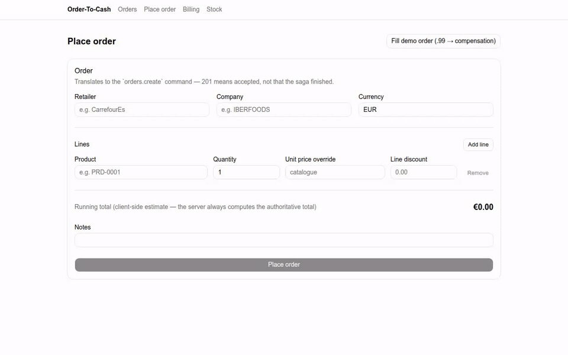

A total ending in `.99` makes the credit simulator reject the hold. The saga then releases the stock it had already reserved and cancels the order, and both compensation steps stay separately visible in the timeline rather than collapsing into one "failed" entry.

### The order timeline

The happy path to `completed`, and the same view for a compensated order — each entry naming the fact that caused it:

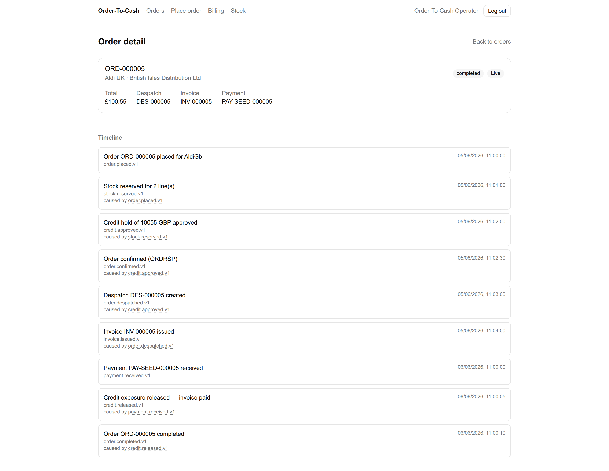

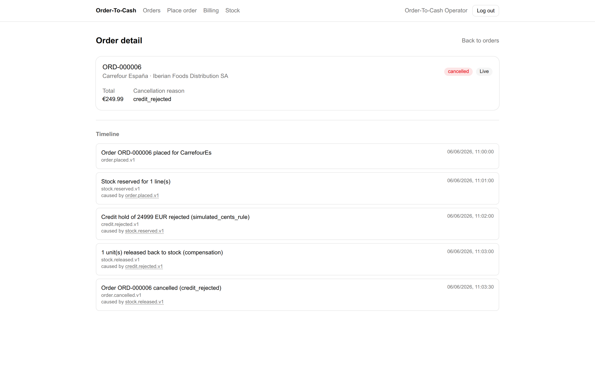

### One order, one trace, six services

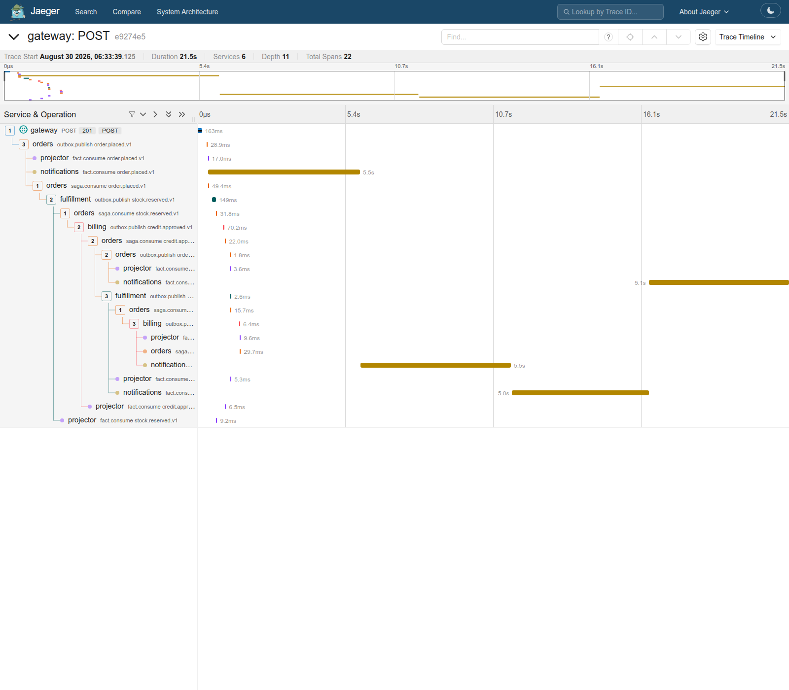

22 spans, depth 11, across all six services — HTTP into the Gateway, NATS RPC, MySQL, the outbox relay, Kafka, and every consumer that reacted. The `traceparent` is carried on the message envelope, which is what joins the producer's span to the consumer's.

### Grafana

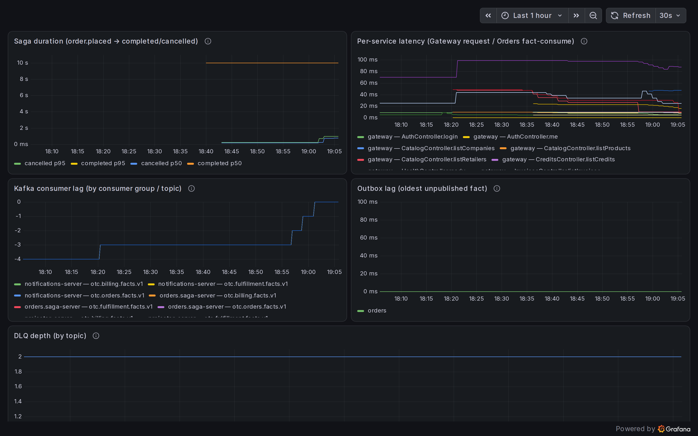

Saga duration (p50/p95, split by `completed` vs `cancelled`), per-service latency, Kafka consumer lag read from the broker's own offsets, outbox lag and DLQ depth. Note that **Saga duration is legitimately empty until an order reaches a terminal state in the current process** — OTel records that histogram only on completion or cancellation, so a freshly restarted stack shows "No data" until the first saga finishes.

### Notifications, and the external world

Mailpit receives every notification the system sends — no account, no quota, and no SMTP password anywhere in the repo:

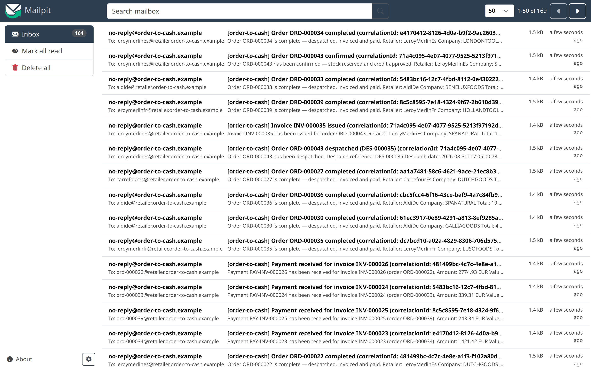

The rest of the operator UI — placing an order, the order list, billing and stock:

<p align="center">
  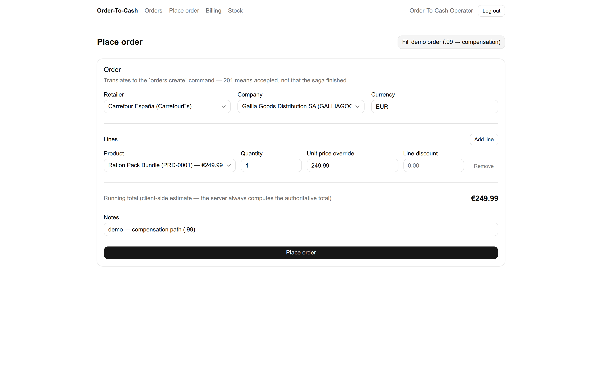
  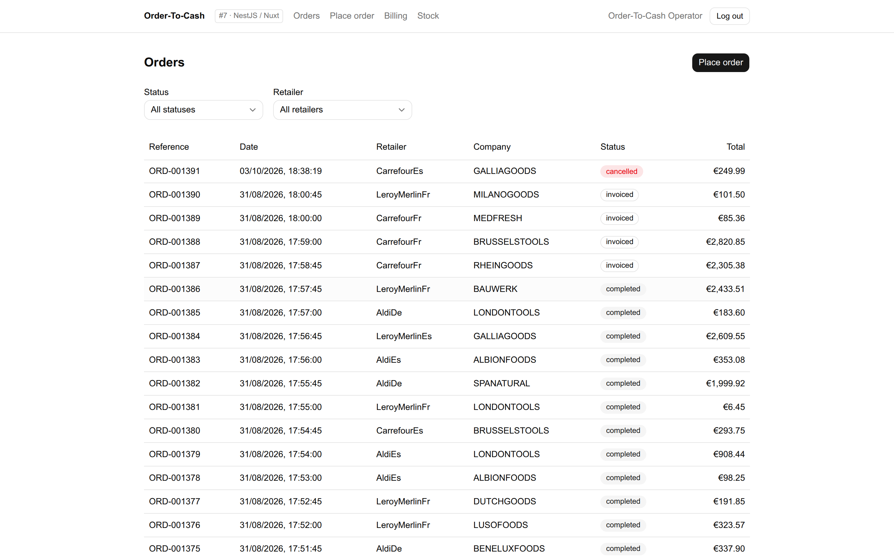
  <br/>
  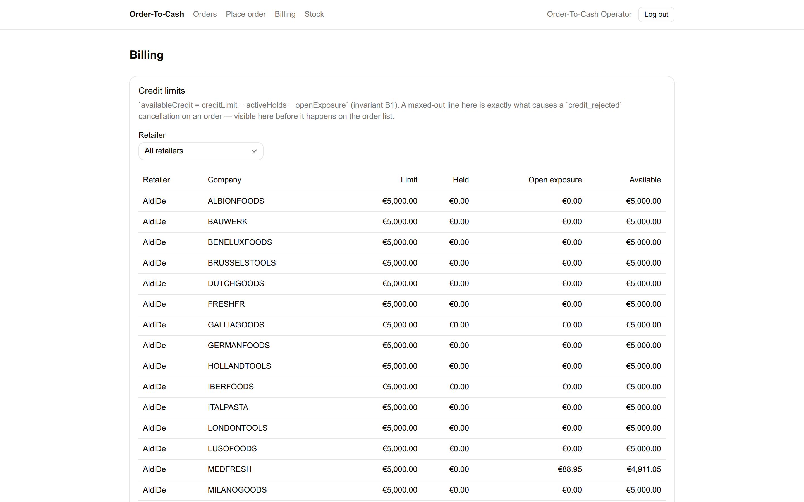
  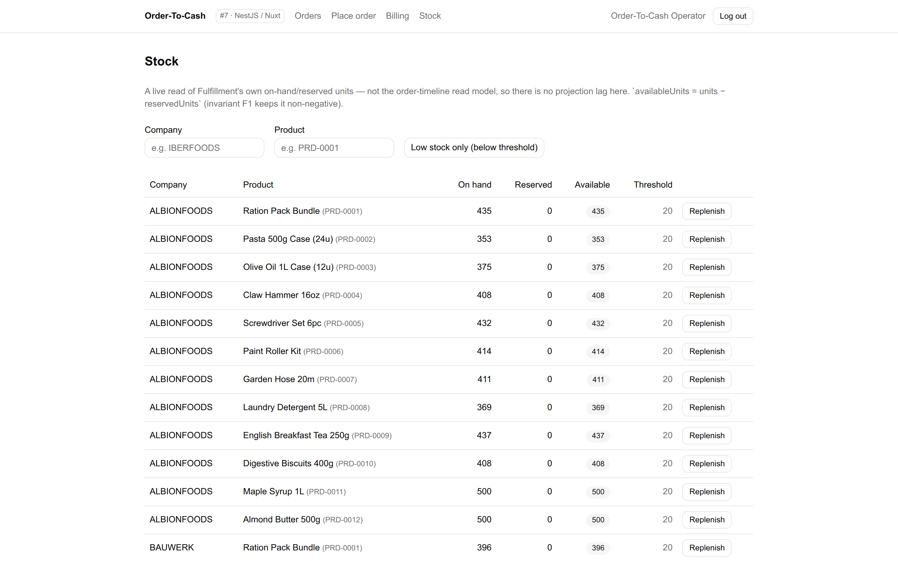
</p>

The four n8n workflows that drive the system unattended, and their executions firing on their own schedules:

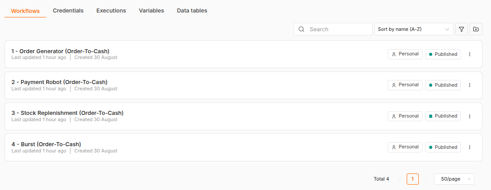

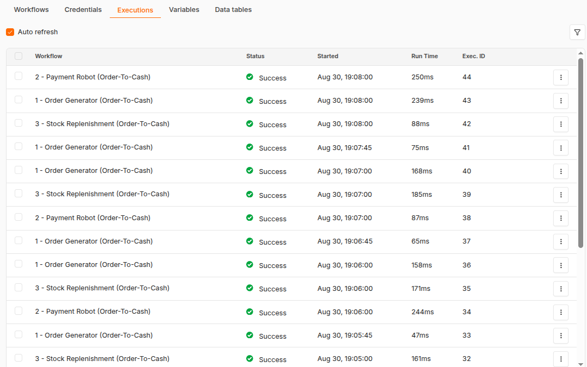

## Tech stack

| Layer | Technology |
|-------|-----------|
| Runtime | Node.js 24 LTS + TypeScript |
| Backend | NestJS 11, `@nestjs/cqrs`, `@nestjs/microservices` |
| Write databases | MySQL 8 — database per service (orders, fulfillment, billing, notifications) |
| ORM | Drizzle ORM (MySQL dialect) |
| Read model | MongoDB 7 — `order_timeline` collection |
| Domain facts | Apache Kafka (KRaft single node) + Redpanda Console |
| RPC | NATS 2 core request-reply (no JetStream) |
| Observability | OpenTelemetry → OTel Collector → Jaeger + Prometheus + Grafana |
| Frontend | Nuxt 4, shadcn-vue, Tailwind CSS v4, TanStack Query |
| Testing | Vitest (the only runner), Testcontainers, Supertest, Vue Testing Library, Playwright |
| Demo workflows | n8n — 4 pre-loaded workflows, Gateway REST API only |
| Monorepo | pnpm workspaces |
| Infrastructure | Docker Compose (~19 containers) |

## Architecture

Six NestJS services talking over **two brokers with different jobs**. Four of them own a MySQL database each (`otc_orders`, `otc_fulfillment`, `otc_billing`, `otc_notifications`); the Projector owns the MongoDB read model; the Gateway owns no store of its own. Clean Architecture inside every service — `presentation → application → domain`, with `infrastructure` implementing the ports the application declares, and `domain/` holding zero framework imports (enforced by an ESLint rule, not by convention).

```text
        Web (Nuxt 4)                     n8n  ("the external world")
             |                                     |
             |  REST + SSE                         |  REST
             v                                     v
      +--------------------------------------------------+
      |              Gateway / BFF  (REST, JWT)           |
      +--------------------------------------------------+
         |   |   |                                  |
         |   |   |  NATS RPC (request-reply)        |  direct read-only query
         |   |   |                                  v
         |   |   |                          [ MongoDB read model ]
         |   |   |                                  ^
         |   |   |                                  | writes
         |   |   +---------------------------+      |
         v   v                               v      |
   +-----------+     NATS RPC        +-------------+|   +---------------+
   |  Orders   |-------------------->| Fulfillment ||   | Notifications |
   | (saga     |  stock.reserve      +-------------+|   +---------------+
   |  orchestr)|  despatch.create           |       |          |
   +-----------+                            |       |          | SMTP
         |            NATS RPC        +-----------+ |          v
         |--------------------------->|  Billing  | |      [ Mailpit ]
         |            credit.hold     +-----------+ |
         |            invoice.issue         |       |
         |                                  |    +-----------+
         |   facts                facts     |    | Projector |
         v          v                       v    +-----------+
   ==================================================^==========
             Kafka  -  3 fact topics + 3 DLQ topics  |
   ===================================================
             ^                                   consume
             +---- consumed by Orders, Projector, Notifications

   Write models:  otc_orders   otc_fulfillment   otc_billing   otc_notifications
                  (MySQL, one database per service)
```

**One relationship deliberately breaks the database-per-service boundary, and it is worth naming rather than hiding.** The Gateway does not call the Projector — the Projector answers no RPC subject at all. The Gateway queries the read model's MongoDB collection **directly, read-only** (`mongo-order-read-model.adapter.ts`), because the Projector is the only service that *writes* it and a query hop that adds nothing but latency is hard to justify. It is the one place two services share a datastore, and the cost is real: the "database per service" boundary below holds for the four write models and not for the read model.

Every service writes facts through a **transactional outbox** — the fact row and the state change commit in one transaction, and a relay publishes them afterwards. No service ever writes to Kafka and its database in the same breath.

### Kafka carries facts, NATS carries RPC

The single most-used rule in this codebase. Every inter-service *messaging* interaction must be justifiable by one row of this table — the Gateway's direct read of the read model, above, is the one deliberate exception, and it is not messaging:

| | **NATS (core, request-reply)** | **Kafka (fact topics)** |
|---|---|---|
| **Carries** | A *request* — "please do this" | A *fact* — "this happened" |
| **Tense** | Imperative: `stock.reserve`, `credit.hold`, `invoice.issue` | Past: `order.placed.v1`, `credit.rejected.v1` |
| **Caller wants** | An answer, now, or a timeout | Nothing — it has already committed |
| **If nobody listens** | A legitimate error the caller handles | A bug; facts must always be consumable |
| **Durability** | None, deliberately — no JetStream | Durable, replayable, partitioned by `correlationId` |
| **Retried by** | The caller, against a durable `saga_commands` row | The consumer, then a `.dlq` topic after 3 attempts |
| **Who may consume** | Exactly one responder | Anyone — Orders, Projector and Notifications all consume the same fact |

**The rule that falls out of it, and the one worth internalising:** a command's response *never* advances the saga. The orchestrator uses the reply only to decide whether to retry. The saga moves only when the corresponding **fact** arrives — because only the fact is durable, replayable, and seen by the projector and the notifier too.

So `credit.hold` returning "approved" over NATS changes nothing on its own; `credit.approved.v1` arriving over Kafka is what moves the order. That separation is why a Billing crash between the two loses nothing.

### The saga

Orchestrated, not choreographed — Orders owns the flow, so there is exactly one place to read it and one place to put compensation. Full step tables and sequence diagrams are in [`specs/shared/saga.md`](specs/shared/saga.md); this is the shape:

```text
  HAPPY PATH
  placed --stock.reserved--> stock_reserved --credit.approved--> credit_approved
      --> confirmed --order.despatched--> despatched --invoice.issued--> invoiced
      --payment.received--> paid --credit.released--> completed

  COMPENSATION
  placed --stock.rejected--> cancelled                (nothing to undo)

  stock_reserved --credit.rejected--> [release the stock] --stock.released--> cancelled
```

Two edges need a word of explanation. `credit.approved.v1` moves the order through **two** states in a single handler (`stock_reserved → credit_approved → confirmed`, one aggregate load/save), emitting `order.confirmed.v1` as a *result* — Orders consumes that fact and deliberately does nothing with it (`saga-steps.ts` maps it to `skip`), which is why no edge is labelled with it. And the final hop to `completed` is driven by `credit.released.v1`, not by the payment: Billing emits `payment.received.v1` and `credit.released.v1` from one transaction, and it is the second that closes the saga.

At `invoiced` the saga **stops and waits for the outside world** — no internal timer, no polling. A remittance arrives through the Gateway (the operator's button, an API test, or the n8n payment robot), and only then does it continue.

Compensation is ordered and separately visible: on `credit.rejected.v1` the reserved stock is **released first**, and the order is cancelled only once `stock.released.v1` confirms it. Both steps appear as their own timeline entries rather than collapsing into one "failed" — see the compensation screenshot above.

## Prerequisites

| Tool | Version | Notes |
|------|---------|-------|
| Node.js | 24.19.0 | `nvm use` — the version is pinned in [`.nvmrc`](.nvmrc) |
| pnpm | 11.x | via corepack: `corepack enable && corepack install -g pnpm@latest` |
| Docker + Compose | latest | required from Phase 4 onwards |

> **If you run more than one Docker daemon** (e.g. Docker Desktop *and* the system Engine), be aware that `docker` follows your active **context** while Testcontainers does not — it reads `DOCKER_HOST`, then falls back to `/var/run/docker.sock`. The integration tests can therefore run against a different daemon than your compose stack, and their disposable containers will be invisible to a plain `docker ps`. Everything still works; to watch them, point the CLI at the same socket: `DOCKER_HOST=unix:///var/run/docker.sock docker ps`.
>
> **On Linux, prefer the native Docker Engine over Docker Desktop.** Docker Desktop on Linux runs every container inside a VM, which costs a large, persistent slice of host RAM and does not release it when the containers stop. The native Engine also writes straight to the host filesystem rather than through a VM disk image, which matters for a stack running four databases. If you have both, `docker context use default` also removes the two-daemon split described above by pointing the CLI at the same socket Testcontainers already uses.

```bash
git clone https://github.com/peelmicro/order-to-cash-nestjs.git
cd order-to-cash-nestjs
nvm use            # -> Now using node v24.19.0
cp .env.example .env
```

## Working with the monorepo

```bash
pnpm install       # all 10 workspaces
pnpm quality       # lint + typecheck + test:coverage, everywhere — the gate every feature keeps green
pnpm -r build      # build all workspaces
pnpm dev:orders    # any service: dev:gateway|orders|fulfillment|billing|notifications|projector (ports 3001–3006)
pnpm dev:web       # Nuxt 4 on http://localhost:3010
pnpm contracts:generate   # regenerate types from specs/shared/*.yaml
pnpm contracts:check      # fail if committed types drift from the specs
```

Two packages carry everything shared — and nothing else is shared between services:

- [`packages/shared-kernel`](packages/shared-kernel) — `Money` (integer minor units), `Quantity`, `GLN` (GS1 mod-10), `UniqueId`, `Entity`/`AggregateRoot`, `DomainError`. **Zero runtime dependencies**, 68 tests, 100% coverage.
- [`packages/contracts`](packages/contracts) — TypeScript types **generated** from `specs/shared/asyncapi.yaml` + `openapi.yaml` (95 schemas). Hand-writing an API type anywhere else is a review defect; editing generated output is caught by `pnpm contracts:check`.

Domain purity is enforced, not requested: an ESLint `no-restricted-imports` rule fails the build on any framework or infrastructure import inside a `domain/` folder.

> **TypeScript version:** 5.9.3. TypeScript 7 was evaluated per plan — NestJS 11 (runtime DI with `emitDecoratorMetadata`) and Vitest both passed under 7.0.2, but `vue-tsc` cannot load TS7's package layout (`ERR_PACKAGE_PATH_NOT_EXPORTED`, reproduced independently), which blocks Nuxt type-checking. Revisit when vue-tsc ships TS7 support.

### Coverage gates

`pnpm quality`'s third step is `pnpm run test:coverage` (`pnpm -r --if-present --no-bail run test:coverage`), not the plain `test` script — every workspace's own `vitest.config.mts` `coverage.thresholds` is what actually fails the gate, and it is enforced whether or not SonarQube is running. Two tiers, not one global number:

- **The six NestJS services** (`apps/{orders,billing,fulfillment,gateway,notifications,projector}`) hold `src/domain/**` to **80%** (statements/branches/functions/lines) via a per-glob threshold, and everything else in the service to **60%** — a well-covered `infrastructure/`/`presentation/` layer can never mask a thin `domain/`. (`apps/notifications/src/domain/` is currently an empty placeholder — `.gitkeep` only, no files — so its 80% tier is vacuously satisfied; see `progress/impl_sonarqube_quality_gates.md` for that observation.)
- **`packages/shared-kernel`** (pure domain, nothing else) is 80% globally; **`packages/contracts`** excludes generated code and holds the hand-written generator/barrel to 80%; **`apps/web`** and **`apps/seed`** have no `domain/` layer, so only the 60% floor applies.
- **`apps/seed`**'s three MySQL-writing files (`src/writers/{orders,fulfillment,billing}-db.writer.ts`) and `src/verify.ts`'s DB-querying half are excluded from ITS number (`coverage.exclude`, with the reasoning written into the config itself) — they are genuinely exercised, just by `seed.integration.spec.ts`'s Testcontainers run (`pnpm test:integration`), which a Docker-independent `pnpm quality` cannot reach.

`pnpm -r --no-bail` runs every workspace to completion and reports every violation together (`Summary: N fails, M passes`) rather than aborting — and tearing down — the rest of the recursive run at the first failure.

### SonarQube (optional, additional — never the enforced gate)

SonarQube (`pnpm dc:up:sonar`, ~1.5–2.3 GB RAM, `sonar` compose profile) is a genuinely optional, additional code-quality view on top of the coverage gate above, never a substitute for it — `pnpm quality` enforces coverage with SonarQube stopped. `sonar-project.properties` at the repo root configures a scan across all ten workspaces, feeding every workspace's own `coverage/lcov.info` (regenerated first, so every report file is fresh) to the JS/TS analyser and excluding `node_modules`/`dist`/build output/`packages/contracts/src/generated/**`.

```bash
pnpm dc:up:sonar                    # http://localhost:9000 once healthy (admin/admin on first login)
export SONAR_TOKEN=squ_xxxxxxxx     # a SonarQube user token, "Administration > Security > Users > Tokens"
pnpm run sonar:scan                 # regenerates every coverage/lcov.info, then runs the scanner
```

`sonar:scan` (root `package.json`) fails fast with a clear message, rather than a confusing auth error, if `SONAR_TOKEN` is unset — it reads the token from the environment on purpose, never hardcoded. It is exactly `pnpm run test:coverage` (stale LCOV would silently report the wrong numbers otherwise) followed by:

```bash
docker run --rm --network otc-net -v "$PWD:/usr/src" -e SONAR_TOKEN \
  sonarsource/sonar-scanner-cli \
  -Dsonar.host.url=http://otc-sonarqube:9000
```

— the same `--network otc-net` / `-Dsonar.host.url=http://otc-sonarqube:9000` shape documented above, verified end to end (exit 0, gate `OK`) as `pnpm run sonar:scan` itself, not just as a standalone `docker run`.

**If `pnpm dc:up:sonar` refuses to start**, with `network otc-net ... has incorrect label com.docker.compose.network set to ""`, then `otc-net` was created by hand rather than by Docker Compose and lacks compose's own network label. A fresh clone never hits this, because compose creates the network itself on the first `pnpm dc:up:infra`. Do **not** delete the network to fix it while other containers are attached — start SonarQube directly instead:

```bash
docker run -d --name otc-sonarqube --network otc-net \
  -p "${SONARQUBE_HOST_PORT:-9000}:9000" \
  -e SONAR_ES_BOOTSTRAP_CHECKS_DISABLE=true -e TZ=Europe/Madrid \
  -v sonarqube_data:/opt/sonarqube/data \
  -v sonarqube_logs:/opt/sonarqube/logs \
  -v sonarqube_extensions:/opt/sonarqube/extensions \
  sonarqube:26.8.0.126808-community
```

**A related trap:** `pnpm dc:down:sonar` silently does nothing against a container started that way, because Compose only manages what it created. Stop it with `docker stop otc-sonarqube`.

**First scan (phase 21 follow-up).** Once disk headroom allowed SonarQube to come up healthy, a real scan ran clean: 27,814 LOC analysed. It found 29 "bugs" and 12.3% duplication — see the two subsections below for what each number means and what was done about it. `progress/impl_sonarqube_quality_gates.md`'s "SonarQube first-scan findings" section has the full before/after and the gate results that verified the fixes.

**Quality gate: `OK`.** The default SonarQube quality gate ("Sonar way") only evaluates *new* code (`new_violations`, `new_coverage`, `new_duplicated_lines_density`, measured against the previous version). Two `typescript:S5906` findings in `apps/web/app/pages/{billing,stock}/index.spec.ts` (a generic `.length` assertion where `toHaveLength(n)` reports better on failure) were genuinely trivial and fixed directly; the three `Web:InputWithoutLabelCheck` dismissals above are the rest of the five `new_violations` the gate was failing on. `pnpm run sonar:scan` now reports `new_violations: 0`, `new_coverage: 97.0` (≥80 required), `new_duplicated_lines_density: 0.0` (≤3 required) — `curl -u "$SONAR_TOKEN:" "http://localhost:9000/api/qualitygates/project_status?projectKey=order-to-cash-nestjs"` returns `"status":"OK"`.

#### The 29 first-scan "bugs" — 29 → 13 → 10, and the remaining 10 are analyser limitations, not unfixed defects

29 findings on the first scan: 20 genuine WCAG accessibility defects in `apps/web`, and 9 `typescript:S7739` misfiring on MongoDB `$switch` syntax (see below). A follow-up pass closed the 9 `S7739` findings (suppressed at the config level, see below) and 7 of 15 form-control findings — `<Input>` fields with no `id` associated to a visible `<Label for="…">`, fixed and confirmed closed in the tool — leaving 13. Of those 13, the 3 that were `Web:InputWithoutLabelCheck` hits on `apps/web/app/pages/orders/place.vue`'s Retailer/Company/Product `<Select>` opening tags (lines 282, 301, 349) were formally dismissed as false positives via the SonarQube API (`resolution=FALSE-POSITIVE`, with the reasoning below recorded as an issue comment on each), so the tool now reports **10**, not 13 — the honest arithmetic is 29 → 13 → 10 (dismissed), never 29 → 0.

The remaining 8 `<Select>` and 5 table findings are real, current, and — verified against the live accessibility tree, not just by inspection (`progress/impl_sonarqube_quality_gates.md`'s follow-up pass) — are analyser limitations, not unfixed defects: 8 `<Select>` findings had a plain `<span>` next to them with no `for`/`id` at all; that is now a proper `<Label for="…">`/`id` pair, and the live accessibility tree confirms every one resolves to a correctly-named `combobox` — but the rule wants the `id` on `<Select>` itself, which has no DOM node of its own (the ARIA `combobox` lives on the child `SelectTrigger`), so it stays flagged (3 of these 8 are now formally dismissed as false positives, per the paragraph above; the other 5 are on `billing/index.vue` and `orders/index.vue`, not yet dismissed). The 5 table findings (the shared `ui/table/Table.vue` primitive plus its 4 callers) were never real defects: SonarQube's HTML/`Web` analyser scans each `.vue` file's raw template in isolation and cannot resolve Vue SFC component composition, so a `<TableHead>` component compiling to a real `<th scope="col">` in a different file is invisible to it — the rendered DOM carries the `<th>` and its `scope` at runtime regardless.

The other 9 were `typescript:S7739` ("Do not add `then` to an object"), all 9 in one file, `apps/projector/src/infrastructure/persistence/legacy-document-backfill.ts:36-44` — a MongoDB `$switch` aggregation expression, where `then` is MongoDB's own required branch syntax (`{ case: {...}, then: 1 }`), never a Promise/thenable. Suppressed at the config level, scoped to the whole file and rule (not the nine individual lines, so a future branch in the same `$switch` stays covered) — `sonar-project.properties`'s `sonar.issue.ignore.multicriteria`, with the full reasoning written there and cross-referenced by a short comment at the flagged code itself. Checked the rest of the repo (including `delta-to-pipeline.ts`, which builds similar aggregation expressions in the same directory) for the same `$switch`/`then` shape — nowhere else today.

#### 12.3% duplication — a recorded architectural decision, not neglect

SonarQube reports 12.3% duplication, concentrated in every service's `infrastructure/outbox` and `test-support` directories (67–89% duplication there specifically). This is `CLAUDE.md`'s own rule, not an oversight: "The only shared runtime code is `packages/shared-kernel` (dependency-free) and `packages/contracts` (generated types). Nothing else is shared" — so each of the six NestJS services carries its **own copy** of the transactional-outbox and idempotent-consumer pattern rather than importing a shared package. The guard that keeps the copies from silently diverging is the **parity spec** — but it is not distributed one-per-service: three specs, all centralised in `apps/orders` and `apps/seed` (`apps/orders/src/infrastructure/outbox/outbox-relay.parity.spec.ts`, `apps/orders/src/infrastructure/messaging/idempotent-consumer.parity.spec.ts`, `apps/seed/src/outbox-parity.spec.ts`), read every other app's copy off disk and assert banner-stripped byte identity. If `apps/billing`'s outbox copy drifts from its siblings, it is **`apps/orders`'** suite that fails, not billing's own. This number is deliberately **not** excluded from the scan (no `sonar.cpd.exclusions` entry for it) — an assessor should see 12.3% and read it as a recorded, load-bearing constraint (database-per-service boundary, no cross-service runtime coupling) rather than as unmanaged copy-paste debt.

## Running the infrastructure

The infrastructure stack alone, without the application services — useful when you want to run a service from source against real brokers and databases:

```bash
pnpm dc:up:infra   # 12 containers + a one-shot kafka-init job
./init.sh          # environment + backlog + spec coherence; exits 0 when healthy
```

Poke at the running stack by hand with the [`http/`](http/) files and the REST Client VS Code extension — service liveness, the NATS subjects currently answered, the domain facts on each Kafka topic, and the Prometheus/Jaeger/Grafana APIs. The scripts `pnpm order:place`, `pnpm order:over-limit` and `pnpm saga:watch` drive and watch the saga straight over NATS, without going through the Gateway. An order now runs the **whole cycle** unattended — placed → stock reserved → credit approved → confirmed → despatched → invoiced → paid → completed. `pnpm order:place` for the happy path, `--qty 1` for a total ending in `.99` (the simulator rejects it and the saga compensates), `pnpm order:over-limit` for a genuine credit rejection, and `--discount 300` to see the invoice total follow the order's net total rather than its gross. Then `pnpm invoice:list` and `pnpm invoice:pay --invoice INV-000006 --ref PAY-1 --correlation <order id>` to register the remittance that closes it.

| UI | URL |
|---|---|
| Redpanda Console (Kafka topics + DLQs) | http://localhost:8080 |
| Jaeger (traces) | http://localhost:16686 |
| Grafana | http://localhost:3030 |
| Prometheus | http://localhost:9090 |
| n8n | http://localhost:5678 |
| Mailpit (notification emails) | http://localhost:8025 |
| SonarQube (optional) | http://localhost:9000 — `pnpm dc:up:sonar` |

Every image is **pinned to an exact version** (MySQL 8.4.11 LTS, MongoDB 8.3.8, Kafka 4.3.1 KRaft, NATS 2.14.5 **core-only — no JetStream**, Jaeger v2 2.20.0, Prometheus v3.14.0, Grafana 13.2.0, n8n 2.36.2, Mailpit v1.27.5, `danielqsj/kafka-exporter` v1.9.0) so the sibling assessments reproduce the same stack. The `kafka-init` one-shot container **derives the six topics (3 fact topics + 3 `.dlq`) from [`specs/shared/asyncapi.yaml`](specs/shared/asyncapi.yaml)** — the spec is the source of truth, and topic drift fails loudly instead of passing silently. Re-run it any time with `pnpm kafka:topics`.

**Notifications' SMTP adapter is provider-neutral.** `apps/notifications` sends outbound email via plain nodemailer-over-SMTP (`SMTP_HOST`/`SMTP_PORT`/`SMTP_USER`/`SMTP_PASSWORD`/`SMTP_FROM_EMAIL` — `.env.example` § SMTP) — nothing in the adapter is vendor-specific. The default stack points it at **Mailpit**, self-hosted above with no account, no quota and no secret to leak. `SMTP_*` can equally point at Mailtrap, or any other real SMTP provider, by supplying real host/credentials — Mailtrap is documented here as one option among many, not a dependency this repo requires anyone to sign up for.

Grafana auto-provisions one dashboard, **"Order To Cash — Overview"** ([`infra/grafana/dashboards/order-to-cash-overview.json`](infra/grafana/dashboards/order-to-cash-overview.json)) — saga duration, per-service latency, Kafka consumer lag, outbox lag and DLQ depth, all against live PromQL (`infra/grafana/provisioning/dashboards/`). Consumer lag is the one metric no service under `apps/` computes itself: `kafka-exporter` (a new container, `docker-compose.infra.yml`) queries the broker's own real consumer-group offsets, scraped by Prometheus as `kafka_consumergroup_lag` (`infra/prometheus/prometheus.yml`). Measured resource cost: **7.4 MiB RSS, 0.00% CPU** — negligible against Grafana's 256 MiB and Prometheus' 33 MiB — see `progress/impl_observability_dashboards.md` for the full decision and every panel's verified query.

With the infrastructure up, `pnpm seed` loads the demo data: master data (3 currencies, 12 products, 7 retailers and 22 suppliers with valid GS1 GLNs, credit limits, stock) plus six sample orders — five completed sagas and one cancelled by the `.99` credit rule — consistent across the three MySQL databases and the MongoDB `order_timeline`. Deterministic and idempotent: run it twice, nothing changes.

> **Deviation from the task document:** MongoDB is 8.3.8 rather than the mandated 7.x — version 7 was current when the task was written; nothing in the specification depends on 7-only behaviour, and the deviation is deliberate.

## Running the full stack in Docker

Everything above runs the application services from the CLI (`pnpm dev:*`) against a compose stack that provides only infrastructure. Phase 23 adds application containers on top of the same infrastructure file — build once, then every service (including the Nuxt 4 web app) runs as a container reachable on the same ports as the CLI path:

```bash
pnpm dc:up:apps    # docker compose -f docker-compose.infra.yml -f docker-compose.apps.yml up -d
                    # brings up infra (if not already up) + 4 one-shot Drizzle
                    # migration jobs + 6 NestJS services + the web app
```

Always pass **both** compose files together (`dc:up:apps` already does). `otc-net` is defined only in `docker-compose.infra.yml`, so starting the apps file alone fails loudly ("refers to undefined network otc-net") instead of silently creating a second, disconnected network; together, the first `up` on a clean machine creates it. `docker compose ... down` tears down both layers together the same way.

| App | URL | Depends on (startup order) |
|---|---|---|
| Gateway (REST + Swagger) | http://localhost:3001/docs | MongoDB, NATS |
| Orders | http://localhost:3002/health/ready | its own `orders-migrate` job, Kafka topics, NATS |
| Fulfillment | http://localhost:3003/health/ready | its own `fulfillment-migrate` job, Kafka topics, NATS |
| Billing | http://localhost:3004/health/ready | its own `billing-migrate` job, Kafka topics, NATS |
| Notifications | http://localhost:3005/health/ready | its own `notifications-migrate` job, Kafka topics, Mailpit (SMTP) |
| Projector | http://localhost:3006/health/ready | MongoDB, Kafka topics, NATS |
| Web (Nuxt 4) | http://localhost:3010 | Gateway |

Each of the four MySQL-backed services (orders/fulfillment/billing/notifications) gets its own one-shot `<service>-migrate` job — `restart: "no"`, `depends_on: mysql: condition: service_healthy`, and the app container itself only starts once its migration job has exited `0` (`depends_on: <service>-migrate: condition: service_completed_successfully`). Projector needs no such job — it bootstraps its own MongoDB indexes/backfill on every boot, in `main.ts` (same as the CLI path).

`apps/seed` is a one-off CLI, not a server — it stays behind the `seed` compose profile so `up -d` never starts it:

```bash
pnpm dc:seed       # docker compose -f docker-compose.infra.yml -f docker-compose.apps.yml --profile seed run --rm seed
```

Other `dc:*:apps` scripts mirror the `dc:*:infra` ones already in use: `dc:down:apps`, `dc:ps:apps`, `dc:logs:apps`, `dc:clean:apps` (adds `-v`), `dc:build:apps`.

Every app image is built **locally** (`pull_policy: build`, same discipline as `docker-compose.infra.yml`'s `otel-collector`/`kafka-init`) — none of these are published anywhere. Build context is always the **repo root** (`context: .`, never `apps/<service>`): pnpm workspaces need the full lockfile plus every `packages/*/package.json` to install correctly. Every NestJS service's Dockerfile ([`infra/docker/service/Dockerfile`](infra/docker/service/Dockerfile), shared across all six via a `SERVICE` build ARG) runs the real build — `tsc -p tsconfig.build.json`, never `tsx`/esbuild — for exactly the reason CLAUDE.md's DI-tokens rule exists: `emitDecoratorMetadata` only survives a real `tsc` compile, and this is the one place a wrong choice here would silently break every constructor-injected provider. `apps/web` ([`infra/docker/web/Dockerfile`](infra/docker/web/Dockerfile)) is a different shape — Nitro's `node-server` preset produces a self-contained `.output/` needing no monorepo `node_modules` at runtime — and `apps/seed` ([`infra/docker/seed/Dockerfile`](infra/docker/seed/Dockerfile)) keeps its own `tsx`-based script unchanged, per CLAUDE.md's explicit carve-out for that one app.

### Inspecting the dead-letter queues

Each of the three fact topics has a `.dlq` sibling. A consumer that fails a fact three times dead-letters it rather than blocking its partition, and the dead letter carries a full diagnostic header set — including the **`traceparent`**, so a dead letter can be traced back to the order that produced it instead of being an orphan.

The friendly way is **Redpanda Console** at http://localhost:8080 (topics → `*.dlq` → inspect headers). From the CLI:

```bash
docker exec otc-kafka sh -c \
  "/opt/kafka/bin/kafka-console-consumer.sh --bootstrap-server localhost:9092 \
   --topic otc.orders.facts.v1.dlq --from-beginning --max-messages 5 \
   --formatter-property print.headers=true --timeout-ms 8000"
```

A real dead letter from this repository's own history — the notifications consumer while its SMTP host was deliberately stopped:

```
x-failed-consumer:notifications  x-attempts:3
x-error:Error: connect EHOSTUNREACH 172.19.0.20:1025
x-original-topic:otc.orders.facts.v1  x-event-type:order.placed.v1
x-first-failed-at:2026-08-30T15:46:48.838Z  x-failed-at:2026-08-30T15:47:10.797Z
traceparent:00-c8c87d5ec6b9ce721a473628325635dd-18aa934db1904c65-01
```

Paste that trace id into Jaeger and you get the whole order, retries included — **while the trace is still there**. Jaeger runs here with its default in-memory storage and no volume (`docker-compose.infra.yml`), so traces do not survive a restart and old ones age out. A dead letter therefore outlives its own trace: the `traceparent` stays correct and permanently resolvable in a deployment with real trace storage, and returns `trace not found` on a long-running demo stack. Configuring a storage backend is the fix; the header is not the problem.

To count what is sitting there:

```bash
docker exec otc-kafka sh -c \
  "/opt/kafka/bin/kafka-get-offsets.sh --bootstrap-server localhost:9092 --topic otc.orders.facts.v1.dlq"
```

**Two honest caveats.** Grafana's *DLQ depth* panel plots a cumulative count, so a line that never falls looks identical whether the last dead letter arrived 30 seconds or 3 days ago. And **there is no replay tooling**: the messages are complete and replayable *in principle* — the payload is the original envelope, unmodified — but re-publishing them is a manual job today. That gap, and the fact that nothing alerts when either quiet ledger grows, is named in [Scaling and production extensions](#scaling-and-production-extensions) as the highest-value thing this system is missing.

## n8n demo workflows

Four workflows, committed as JSON under [`n8n/workflows/`](n8n/workflows/), talk **only to the Gateway REST API** — never a database, a broker, or a service's internal port (see [`specs/shared/n8n-workflows.md`](specs/shared/n8n-workflows.md), the spec both #8 and #9 reuse verbatim). They are demo automation: no requirement `R1`–`R63` is satisfied by them, and no service knows they exist.

| # | Workflow | Trigger | Default schedule |
|---|---|---|---|
| 1 | Order generator | Schedule | every 45s — places one order, ~15% engineered to a `.99` total, so the credit check refuses it |
| 2 | Payment robot ("the bank") | Schedule | every 2 min — pays every invoice `issued` ≥2 min ago, deterministic `paymentReference`, so a repeat is a no-op |
| 3 | Stock replenishment | Schedule | every 5 min — tops up every product below its low-stock threshold |
| 4 | Burst | Manual webhook (`POST /webhook/otc-burst`) | fires `BURST_ORDER_COUNT` (default 20) orders at `BURST_CONCURRENCY` in parallel, on demand |

```bash
pnpm n8n:import    # ./scripts/import-n8n-workflows.sh — imports the 4 committed workflows (always INACTIVE)
pnpm n8n:export    # ./scripts/export-n8n-workflows.sh — writes n8n's own current copy back into n8n/workflows/
```

**Auto-import on startup.** The `n8n-init` one-shot container (same `restart: "no"` / `depends_on: service_healthy` shape as `kafka-init`) imports the four workflows on every `docker compose up`, gated by `N8N_WORKFLOWS_ENABLED` (`.env` — `false` skips it). Imports are always **inactive** regardless of that flag: activate a workflow from http://localhost:5678/workflows when you want its schedule/webhook to actually run — a live UI toggle takes effect immediately and survives restarts. **Scheduled** workflows (order generator, payment robot, stock replenishment) additionally need a full server restart before a *CLI-level* `publish:workflow --active=true` starts ticking — verified live: publishing `otcOrderGenerator` via the CLI produced zero executions against its own interval until `n8n` was restarted. The **webhook** workflow (burst) does not have this restriction — verified live: `publish:workflow --id=otcBurst` followed immediately by `POST /webhook/otc-burst`, no restart, returned `200` and executed. Either way, the UI toggle is the simplest path and needs no restart for either trigger type.

**Removing n8n entirely.** The `n8n` and `n8n-init` services sit behind the `n8n` compose profile — `pnpm dc:up:infra`/`dc:up:apps` pass `--profile n8n` by default (today's behaviour, unchanged); `pnpm dc:up:infra:no-n8n` / `pnpm dc:up:apps:no-n8n` omit it, so neither container starts. Every other service comes up healthy and an order placed by hand (`pnpm order:place`, or the web UI) still runs the full saga to `completed` — n8n is a client of the Gateway, exactly like the web app, and nothing waits for it.

Every tunable (`ORDER_GENERATOR_*`, `PAYMENT_ROBOT_*`, `STOCK_REPLENISH_*`, `BURST_*`, `OTC_GATEWAY_URL`) is an environment variable, documented with its default in `.env.example` — never hardcoded in the workflow JSON, including the three schedule periods and the burst webhook path, which the trigger nodes read via n8n expressions against `$env` (e.g. `secondsInterval: ={{ Number($env.ORDER_GENERATOR_INTERVAL_SECONDS) || 45 }}`). Changing one of these in `.env` takes effect after the workflow is republished and `n8n` is restarted (`docker compose restart n8n`) — same restart requirement as any other activation change on this n8n version, see above.

## End-to-end tests

Playwright drives the real, already-running web UI (never `pnpm dev:web` — see the caveat below) through both saga scenarios end to end: the happy path to `completed` with a payment that flips the invoice to `paid`, and the `.99` credit-rejection path that compensates back to `cancelled`.

```bash
# One-time: install Playwright's chromium browser binary.
pnpm --filter @otc/web exec playwright install chromium
# `--with-deps` additionally installs this browser's OS-level dependencies
# and needs sudo; plain `install chromium` is enough on a machine that
# already has a Chrome/Chromium-capable environment (true of most dev
# machines and CI images), which is why it is the documented default here.

# Run against a running stack, either the containers or a local build,
# pointed at with E2E_BASE_URL:
cd apps/web
E2E_BASE_URL=http://localhost:3010 pnpm run test:e2e

# Or via the root aggregator (same env var, same effect):
E2E_BASE_URL=http://localhost:3010 pnpm run test:e2e
```

`test:e2e` loads `GATEWAY_OPERATOR_USERNAME`/`GATEWAY_OPERATOR_PASSWORD` from the root `.env` automatically (`dotenv -e ../../.env`), for the real login `global.setup.ts` performs before either spec runs.

To *watch* the browser drive the app, or to pass any other Playwright flag, export the root `.env` into your shell and invoke Playwright directly:

```bash
set -a; source .env; set +a          # exports GATEWAY_OPERATOR_PASSWORD et al.
E2E_BASE_URL=http://localhost:3010 pnpm --filter @otc/web exec playwright test --headed
```

Do **not** use `pnpm run test:e2e -- --headed`. `pnpm` appends `-- --headed`, but the script's `dotenv -e ../../.env --` has already consumed a `--`, so Playwright receives `--` and `--headed` as **test-name filters** rather than as an option — the run silently proceeds headless and still reports `3 passed`. Conversely `pnpm exec playwright` alone skips the `dotenv` wrapper and fails fast with `GATEWAY_OPERATOR_PASSWORD is not set`; exporting the env first is what reconciles the two.

**Each full run places two real orders and consumes two real units of `PRD-0006` stock for `ALBIONFOODS`** — this is a real system, not a fixture: nothing is cleaned up afterwards (deliberately — see `progress/review_e2e_playwright.md` §8 for why a cleanup path across four service databases is worse than the noise it would remove). Reset the stack before recording a demo (`docker compose down -v` + `pnpm seed`), not after running this suite.

The suite targets a running, built stack and **cannot run against `pnpm dev:web`** — against a Nuxt dev server the login form's click lands pre-hydration on the cold dev bundle and the subsequent navigation never completes. Point it at the containerised stack (`WEB_PORT`) or at a local production build (`pnpm build && node apps/web/.output/server/index.mjs`) instead.

## Trade-offs

Every row is a decision that could defensibly have gone the other way. The alternative is named, not waved at.

| Decision | Why | What it costs |
|---|---|---|
| **Orchestrated saga**, not choreography | One place to read the flow, one place to put compensation, one place to debug. The `saga_commands` table makes in-flight state inspectable in SQL | Orders knows the whole flow — a coupling choreography avoids, at the price of an emergent process nobody can read end to end |
| **Two brokers** (Kafka facts + NATS RPC) | Each is used for what it is good at, and the distinction is the thing worth teaching | Two pieces of infrastructure, two client libraries, two OpenTelemetry propagation paths |
| **NATS core, no JetStream** | Nothing in the RPC path needs durability or replay — a timeout is a legitimate answer | Would blur the matrix above by duplicating Kafka's job |
| **Polling outbox**, not CDC/Debezium | No dual write, no extra infrastructure, and identical on all three stacks of the trilogy | ~500 ms publish latency and steady DB load. Debezium is the production answer |
| **Topic per service**, not per event | 3 topics + 3 DLQs instead of 14 + 14; new facts need no broker administration; per-order ordering preserved by partition key | Consumers receive facts they filter out |
| **Database per service** on one MySQL instance | Real logical isolation — no cross-database joins, no shared FKs, each service independently extractable | One instance is a single point of failure; production separates them |
| **MongoDB read model**, not a relational replica | A denormalised document is the natural shape for "what happened to order X", and it proves the repository port abstracts the engine | Eventual consistency the UI must surface honestly, plus a second database technology to operate |
| **Credit simulator + `.99` rule**, not a real PSP | Compensation must be demoable deterministically in five seconds | Demonstrates saga design rather than payment integration. Labelled an affordance in the spec, not a credit policy |
| **n8n as the external world** | Payments and replenishment arrive from outside, as in reality — no hidden in-service timers faking demand. It speaks only the public REST API, so the same JSON serves #8 and #9 | One more container, demo-only |
| **Gateway reads the read model directly**, rather than through an RPC hop | The Projector is the only writer; a query subject in front of a read-optimised document store would add a hop, a serialisation and a failure mode for no gain | It is the one place two services share a datastore, so "database per service" holds for the four write models and not for the read model. Extracting the Projector later means giving it a query API first |
| **SSE**, not WebSocket | The push is one-directional and `Last-Event-ID` reconnection is free | Bidirectionality nothing here needs is unavailable |
| **pnpm monorepo** | Shared contracts and kernel without publishing packages; one `quality` script | "Monorepo ≠ shared runtime code" must be enforced by lint rules and review, not by repo boundaries |
| **Vitest everywhere, no Jest** | One runner, one config idiom across six services and a Nuxt app | Some NestJS examples assume Jest and need translating |
| **SonarQube behind an opt-in profile** | It costs ~1.5 GB of RAM, and the coverage gates run in `pnpm quality` regardless | Quality never depends on it running |

## Assumptions, and what I would do differently

**Assumptions made explicit**, because each one would be wrong in some real deployment:

- **One currency per order.** `Money` is integer minor units and never crosses currencies; a multi-currency order would need a rate at capture time and a policy for which rate.
- **Business references are globally sequential** (`ORD-000001`). Real EDI often needs per-retailer or per-year sequences, and the counter row is a write bottleneck at volume.
- **A credit hold is a simple ledger sum**, not a scoring model, and the `.99` rule stands in for a bureau call.
- **Stock is a single logical warehouse.** No locations, no allocation strategy, no partial despatch.
- **The operator is a single trusted role.** One JWT, no per-retailer authorisation — a real system scopes every query by the caller's own trading relationships.
- **Facts are never schema-migrated.** Every event is `v1`; a real system needs an upcasting story before the first `v2`.

**What I would do differently:**

- **Make anything the system records on failure visible by default.** Dead letters and unresolvable facts are both recorded here, completely and with their reasons — and neither is surfaced anywhere an operator would look. A queue nobody watches is a queue nobody knows is filling.
- **Write the black-box assertion before the feature, not after.** An end-to-end scenario that asserts only a final status will pass while the detail underneath it is wrong. A general invariant — *every timeline entry follows the entry that caused it* — holds for every order and cannot rot the way a hand-written expected sequence does.
- **Treat a published response with no requirement behind it as a defect.** Traceability normally runs requirement → test, which cannot see a contract promising something no requirement asks for. The reverse walk is cheap and catches exactly that.
- **Validate configuration at the boundary.** `Number(env.X ?? default)` reads as safe and is not: it defends against a variable being *absent* and ignores it being *malformed*. For a rate limit, one bad character is either a silent outage or a silently disabled control.
- **Name the transport on every message pattern.** A hybrid service registers a bare pattern on *every* connected transport — invisible to a single-transport test and fatal at boot.

## Scaling and production extensions

This is an assessment, and it runs as one instance per service on one machine. That is a deliberate scope, not an oversight — but "we did not build it" is a weak claim, so this section separates **what the system already supports and can prove** from **what a production deployment would add**.

### What it already supports

Each claim below is a property of code in this repository, cited so it can be checked rather than taken on trust.

- **The write path is safe to run at N instances.** All three outbox relays claim their batch with `SELECT … FOR UPDATE SKIP LOCKED` ([orders](apps/orders/src/infrastructure/outbox/outbox-relay.ts#L128), [billing](apps/billing/src/infrastructure/outbox/outbox-relay.ts#L104), [fulfillment](apps/fulfillment/src/infrastructure/outbox/outbox-relay.ts#L104)), so two relays polling the same table take disjoint batches and a fact is never published twice because a second instance started.
- **The saga sweeper claims the same way** ([drizzle-saga-command-store.ts:100](apps/orders/src/infrastructure/saga/drizzle-saga-command-store.ts#L100)) — parked and timed-out saga commands are swept exactly once no matter how many Orders instances are running.
- **Business references stay unique under concurrency.** `ORD-`/`DES-`/`INV-`/`CR-` numbers come from a counter row incremented under `SELECT … FOR UPDATE` ([order-number-allocator.ts:84](apps/orders/src/infrastructure/persistence/order-number-allocator.ts#L84)); the second caller blocks rather than racing.
- **Fact consumption scales with partitions, not with instances.** Every consumer joins a named Kafka consumer group, so adding an instance redistributes partitions instead of duplicating delivery. Per-order ordering is preserved because the partition key is the envelope's `correlationId` ([outbox-relay.ts:159](apps/orders/src/infrastructure/outbox/outbox-relay.ts#L159)), which `specs/shared/saga.md` fixes equal to the order id — so every fact about one order lands on one partition.
- **SSE survives a load balancer.** The Gateway subscribes to the projector's read-model signal with a plain core-NATS subscription and **no queue group** ([nats-stream-signal.adapter.ts:33-34](apps/gateway/src/infrastructure/messaging/nats-stream-signal.adapter.ts#L33-L34)), so *every* Gateway instance receives *every* signal and pushes it to the clients it happens to hold. This is the one that is easy to get wrong: a queue group here would look tidier and would silently break the feature, because each signal would go to exactly one instance and the clients connected to the others would simply never update.
- **Database per service** for the four write models. No cross-database joins and no foreign keys across service boundaries, so each is independently extractable onto its own instance. The one documented exception is the read model: the Gateway queries the Projector's MongoDB collection directly, read-only (see Architecture and the trade-off table).

### What production would add

- **A load balancer / horizontal replicas.** Not application code, which is why it is absent here; the section above is the evidence the services would tolerate it. The one thing to size deliberately is the MySQL connection pool, which is untuned and fine for one instance per service but needs checking against `max_connections` before replicating.
- **Rate limiting beyond the login route.** `openapi.yaml` declares `429` on `POST /auth/login`; a public deployment would extend a policy across the write routes and put a quota in front of the read model.
- **TLS termination.** Everything is plain HTTP locally. Production terminates TLS at the edge and the services keep speaking HTTP behind it.
- **A secret store.** Configuration is a `.env` file. Production reads from a managed secret store instead — note that the Mailpit migration removed the last real credential from that file, so what remains is dev-only defaults.
- **CDC instead of a polling outbox.** Documented as a trade-off rather than implemented: Debezium removes the ~500 ms poll latency and the DB load, at the cost of another piece of infrastructure. The port boundary is already in the right place for the swap.
- **Alerting on the two quiet ledgers.** The gap worth naming loudest, because both are *correct* and neither is *visible*. Dead letters carry a full diagnostic header set including a `traceparent`, and `saga_ignored_facts` records every fact that could not be resolved to an order with a reason (`unknown_order`, `precondition_unmet`). Both are complete, both are queryable, and no operator would ever look at either unless told to. Replay tooling for the DLQ and an alert on either table growing is the highest-value thing this system does not have.

### What is deliberately *not* here

- **A cache.** The MongoDB read model already is one — a denormalised projection of "what happened to order X", maintained so queries never touch the write model. Adding Redis in front of it would put a cache in front of a cache and introduce a third consistency story to reason about.
- **JetStream.** Nothing in the RPC path needs durability or replay; a timeout is a legitimate answer. Adding it would duplicate Kafka's job and blur the Kafka-vs-NATS distinction this project exists to demonstrate.

## How this is being built

> **The full process guide lives at [`docs/PROCESS.md`](docs/PROCESS.md)** — the harness and SDD concepts in detail, the agent cast, the feature loop, EARS, the artifact registry, and the current status. **§11 is a ledger of what this process actually caught**, including the failures summarised below and roughly thirty more. What follows is the short version.

The development **process is a deliverable here**, not just the software. This repository carries a spec-driven agent harness, built before any application code:

| Artifact | Role |
|---|---|
| [`AGENTS.md`](AGENTS.md) | Entry map — what to read, when, and the hard rules |
| [`CLAUDE.md`](CLAUDE.md) | Leader role + project conventions |
| [`feature_list.json`](feature_list.json) | Backlog state machine — 41 features, max one `in_progress` |
| [`init.sh`](init.sh) | State coherence check, run at the start of every session |
| [`progress/`](progress/) | External memory: session state, and per-feature **effort records** |
| [`CHECKPOINTS.md`](CHECKPOINTS.md) | Objective session-close criteria (C1–C7) |
| [`.claude/agents/`](.claude/agents/) | leader, spec_author, implementer, reviewer, test_maintainer, suite_runner |

Large features go through the full loop with a **human approval gate**:

```
pending → [spec_author] → spec_ready → ⏸ HUMAN → in_progress
        → [implementer] → in_review → [reviewer] → done
```

Small features skip the spec ceremony but still traverse the state machine. Every agent definition declares which model it runs on. `progress/history.md` records per-feature effort — this repository is the **baseline** the two sibling assessments are measured against.

### What the process produced

Implementation and review ran through the agent harness for 40 of the 41 features, with full specification for the 8 large enough to earn the triple-doc ceremony; the rest are small and traverse the same backlog state machine without it.

Two gates are load-bearing, and they are where the quality actually comes from:

- **Between specification and implementation.** No code is written against an unapproved spec. A spec pass surfaces *open points with recommendations* rather than deciding silently — the contract change that added the login rate limit ended with thirteen of them, five flagged as needing a conscious decision.
- **Before every commit.** The assistant never commits. Each phase stops, reports what was built and how to test it by hand, and a human tests it before anything enters the history.

The reviewer is adversarial by design and read-only: it reports and never patches, and it rejects real work. Several features were approved only on a second or third pass. That is the harness paying for itself — a reviewer that never rejects is a reviewer that is not reading.

**What the discipline actually rests on.** Not "run the tests" — the suite was green through every defect worth learning from here. It is that a claim is not evidence until someone checks it:

- A guard is only real if you *arm its deletion* and watch a named test fail. Every fact-emitting branch here carries one, because a branch whose emission survives deletion on a green suite was never guarded.
- A number is only true if you *re-derive* it, not compare it. Several stale counts survived months of edits because everyone compared them to the last version of themselves.
- A citation is only useful if you *open it*. A file-and-line reference that has drifted is worse than none, because it invites the trust it no longer earns.

The failures that taught each of those — and roughly thirty more, with what caught them and what it cost — are in [`docs/PROCESS.md`](docs/PROCESS.md) §11. They are worth reading before adopting a process like this one, because the interesting ones are not the bugs; they are the checks that looked like they were working and were not.

## The specification

[`specs/shared/`](specs/shared/) is written **before** the code and is the stack-agnostic contract that assessments #8 and #9 reuse verbatim:

| File | What it defines |
|---|---|
| [`domain-model.md`](specs/shared/domain-model.md) | Aggregates, value objects, invariants, both state machines, the 14-fact catalogue |
| [`saga.md`](specs/shared/saga.md) | Happy path and both compensation paths, with sequence diagrams |
| [`requirements.md`](specs/shared/requirements.md) | 63 requirements in EARS notation, `R1`–`R63` |
| [`asyncapi.yaml`](specs/shared/asyncapi.yaml) | AsyncAPI 3.0.0 — fact topics, DLQs, every RPC subject, all payload schemas |
| [`openapi.yaml`](specs/shared/openapi.yaml) | OpenAPI 3.1.0 — the Gateway REST contract |
| [`test-matrix.md`](specs/shared/test-matrix.md) | Every `R<n>` mapped to the test that proves it |
| [`n8n-workflows.md`](specs/shared/n8n-workflows.md) | Functional spec of the four demo workflows |

Both API documents are machine-validated (`@asyncapi/parser`: 0 errors, 0 warnings; `redocly lint`: valid). A feature is not `done` until its rows in the test matrix are green.

## Build progress

| Phase | What | Status |
|-------|------|--------|
| 1 | Environment & repository | ✅ |
| 2 | Harness layer (`AGENTS.md`, `feature_list.json`, `init.sh`, `progress/`, agents) | ✅ |
| 3 | Shared spec — EARS requirements, AsyncAPI, OpenAPI, test matrix | ✅ |
| 4 | Infrastructure compose + Kafka topics & NATS subjects | ✅ |
| 5 | pnpm monorepo scaffold, shared-kernel, contracts | ✅ |
| 6 | Database entities (orders, fulfillment, billing) | ✅ |
| 7 | Deterministic seed job | ✅ |
| 8 | Orders service + saga orchestrator | ✅ |
| 9 | Fulfillment service | ✅ |
| 10 | Billing service | ✅ buyer credit, `.99` simulator, invoicing, remittance intake |
| 11 | Notifications service | ✅ port + SMTP (Mailpit)/console adapters, seven facts, durable idempotency |
| 12 | Projector service + MongoDB read model | ✅ every fact → one order timeline, idempotent, NATS update signal |
| 13 | Gateway / BFF | ✅ 18 REST paths, JWT, NATS RPC, SSE stream (reconnect-safe heartbeat), Swagger at `/docs` |
| 14 | Health checks, OTel propagation, retry + DLQ | ✅ requestId dedup, dead-letter (3 services), tracing, log correlation, metrics, health checks |
| 15 | End-to-end saga verification | ✅ happy path, `.99`/`stock_rejected` compensation, redelivery, poison-to-DLQ, composed trace — all proven against real spawned services |
| 16 | Nuxt 4 web app | ✅ auth (JWT never reaches the browser), place-order, order list, order detail with a live SSE saga timeline, billing (invoices, credits, Register payment) and stock (on-hand/reserved, delta replenish) — plus an error sweep so every failure shows the server's real reason |
| 17 | Web component tests | ✅ 59 tests / 14 files, written inside each feature loop rather than as a separate phase; SSE covered against a real `EventSource` over real HTTP. Coverage 85.8% statements, 87.0% lines |
| 18 | API tests through the Gateway | ✅ black-box over real HTTP against a real spawned Gateway + fleet (supertest as client only) — happy path, `.99` compensation, payment idempotency, and a general causal-ordering invariant asserted on every order |
| 19 | Playwright end-to-end tests | ✅ 3 scenarios in a real browser against the running stack — happy path to `completed`, `.99` compensation with the rendered causal link, invoice → `paid`. Found a real stale-page defect no lower test layer could reach |
| 20 | n8n demo workflows | ✅ four workflows (order generator, payment robot, stock replenishment, burst), Gateway REST API only, committed JSON + auto-import; removing n8n entirely verified not to break the stack |
| 21 | SonarQube + coverage gates | ✅ two-tier coverage enforced in `pnpm quality` (≥80% domain / ≥60% overall), proven to fail when violated and independent of SonarQube; SonarQube configured, run, quality gate **Passed** |
| 22 | Prometheus, Grafana, Jaeger verification | ✅ auto-provisioned Grafana dashboard (5 panels, all reading live data), kafka-exporter for real consumer lag, and one trace genuinely spanning 6 services — the linkage was broken until this phase |
| 23 | Full Docker Compose | ✅ 12 app images (6 services + web + seed + 4 migration jobs), all running non-root as uid 1000, verified healthy from a cold cycle against the live infra stack |
| 24 | Documentation + demo recording | ✅ architecture and saga diagrams, the transport matrix, trade-offs, assumptions, reproducible screenshots and the compensation GIF |
| 25 | Final checkpoint | ✅ full `R1`–`R63` traceability walk, `specs/shared/` re-audited for stack leaks, coverage summary recomputed |

## Licence

[MIT](LICENSE).
