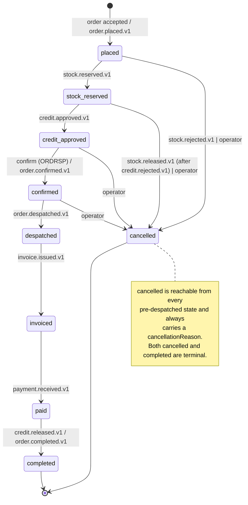
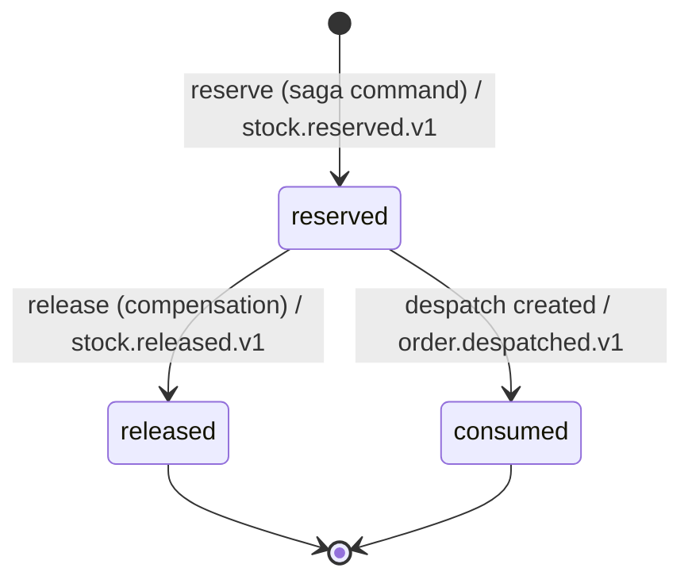
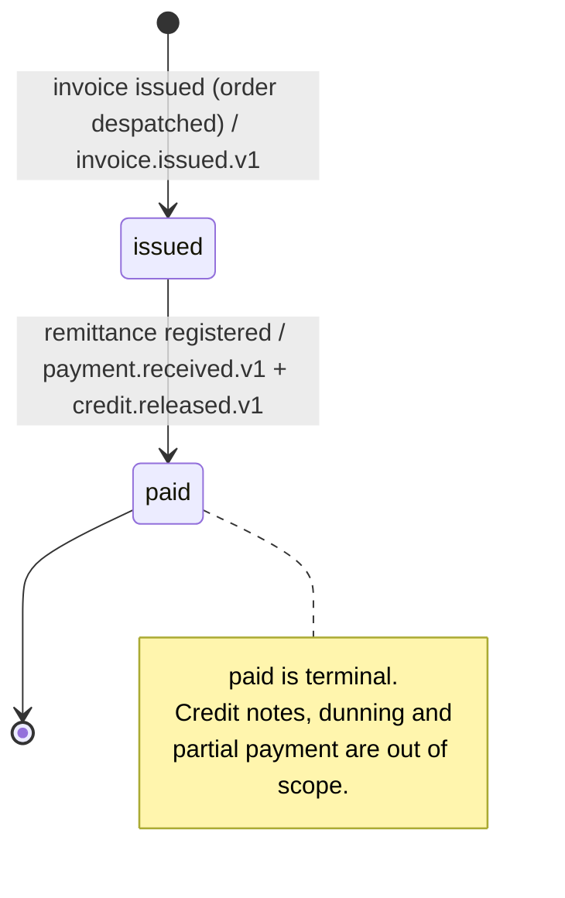

# Shared Domain Model — Order To Cash

> **Scope.** This document is the **stack-agnostic** domain specification of the
> Order-To-Cash trilogy. It is reused **verbatim** by assessments **#7**, **#8**
> and **#9**. It describes *what the model is* — contexts, value objects,
> aggregates, invariants, state machines and facts — never *how it is stored or
> wired*. Persistence shapes, ORMs, frameworks, client libraries and language
> types belong in each assessment's per-feature `design.md`.
>
> **Reading conventions**
> - Field types are **conceptual** (`Money`, `Quantity`, `GLN`, `UniqueId`,
>   `Instant`, `Text`), never storage or language types.
> - "Write model" = the authoritative relational store of one service.
>   "Read model" = the denormalised document store fed by projections.
>   "Fact stream" = the durable, replayable, many-consumer log (Kafka).
>   "RPC transport" = the request-reply bus (NATS core).
> - Every rule stated here has a matching `R<n>` in
>   [`requirements.md`](./requirements.md); the saga that sequences them is in
>   [`saga.md`](./saga.md).

---

## 1. Bounded contexts

Four bounded contexts own domain state and domain rules. Two further components
are **not** bounded contexts — they own no invariants — but appear here because
they consume the model.

| # | Context | Owns | Does **not** own |
|---|---------|------|------------------|
| 1 | **Orders** | The `Order` aggregate and its state machine, order acceptance, the **saga orchestrator**, the reference catalogue (products, retailers, suppliers, currencies) used to compose an order | Stock levels, credit limits, invoices |
| 2 | **Fulfillment** | The `StockItem` aggregate, the stock **reservation** lifecycle (the compensable resource), the `DespatchAdvice` aggregate (DESADV) | Order status, prices, credit |
| 3 | **Billing** | The `BuyerCredit` aggregate (limit + append-only hold/consume/release ledger), the `Invoice` aggregate (INVOIC) and its state machine, the `Payment` entity (remittance intake) | Order status, stock, despatch |
| 4 | **Notifications** | Nothing durable — stateless rendering and delivery of outbound messages triggered by facts | Any aggregate |

| Component | Role |
|---|---|
| **Projector** | Sole writer of the **read model**. Consumes *every* fact and maintains one denormalised `order_timeline` document per order. Owns no invariants; it is a derived view. |
| **Gateway / BFF** | The single external entry point. Translates HTTP into RPC commands/queries, serves list and detail queries from the **read model**, pushes real-time updates. Owns no invariants. |

**Boundary rules (normative)**

1. Each context owns its own write model. There are **no cross-context joins**
   and **no referential links across a context boundary**.
2. Contexts reference each other only by **business identifiers carried in
   messages** — `orderReference`, `retailerCode`, `companyCode`, `productCode`,
   `invoiceReference`, `despatchReference` — never by another context's internal id.
3. The only coupling between contexts is the **message contract** (fact
   envelopes and RPC request/response schemas).
4. A context may emit facts about its own aggregates only. Fulfillment emits
   `order.despatched.v1` because the *despatch* is a Fulfillment fact whose
   subject happens to be an order; it never mutates an `Order`.

---

## 2. Shared kernel — value objects

The value objects below form a small, **dependency-free** shared kernel, copied
per repository (not shared *between services* at runtime). All are immutable and
validate on construction: an invalid value object cannot exist.

### 2.1 `Money`

| Property | Conceptual type | Rule |
|---|---|---|
| `amount` | integer **minor units** | Whole units of the currency's smallest denomination (cents for EUR/GBP/USD). |
| `currency` | ISO 4217 alpha-3 code | Must be a known, seeded currency code. |

**Invariants**

- **M1 — Integer minor units only.** `amount` is an integer count of minor
  units. A decimal, floating-point or fixed-point *major-unit* representation is
  never used, at rest, on the wire, or in arithmetic. `€1,242.50` is
  `Money(124250, "EUR")`.
- **M2 — No cross-currency arithmetic.** Adding, subtracting or comparing two
  `Money` values whose `currency` differs is a domain error. There is no implicit
  conversion and no exchange-rate concept in this model.
- **M3 — Closed arithmetic.** `add`, `subtract` and `multiply by a Quantity`
  return a `Money` of the same currency. Division is not offered — it would
  reintroduce rounding.
- **M4 — Sign.** Negative `Money` is representable (discounts, reversals) but a
  computed order, invoice or credit total is rejected if negative.

> **Why this is a hard rule.** Every amount in the model — line prices,
> discounts, order totals, credit limits, holds, invoice totals, remittances —
> is `Money`. The `.99` simulator rule (§7 and `requirements.md` R42) reads
> `totalAmount mod 100 == 99`, which is only well defined on integer minor units.

### 2.2 `Quantity`

A strictly positive integer count of units. Zero and negative quantities are
rejected at construction; fractional quantities do not exist in this model (the
catalogue is sold in whole units).

### 2.3 `OrderNumber`

A human-readable, unique, immutable business reference in the form
`ORD-` + a zero-padded sequence (`ORD-000001`). Assigned once when the order is
placed and never reassigned. Sibling references follow the same shape:
`DES-######` (despatch advice), `INV-######` (invoice), `CR-######` (credit line).

### 2.4 `GLN` — Global Location Number

The EDI party identifier. Exactly **13 decimal digits**, whose final digit is a
**mod-10 (GS1) check digit** over the preceding twelve:

```
Multiply digits 1..12 alternately by 3 and 1 starting from the right of the
12-digit body (i.e. position 12 × 3, position 11 × 1, …), sum the products,
and the check digit is (10 − (sum mod 10)) mod 10.
```

A GLN whose length, character set or check digit fails is rejected at
construction. Every retailer (buyer) and supplier carries one.

### 2.5 `UniqueId`

An opaque, globally unique identifier (UUID) generated **inside the domain**, not
by the store. Used for aggregate identity and for `eventId`. Two `UniqueId`s are
equal iff their values are equal; identity is never inferred from a store's
auto-increment.

---

## 3. Orders context — the `Order` aggregate

### 3.1 Structure

**Aggregate root: `Order`**

| Field | Conceptual type | Notes |
|---|---|---|
| `id` | `UniqueId` | Aggregate identity. **Also the saga `correlationId`.** |
| `orderReference` | `OrderNumber` | Unique, immutable |
| `orderDate` | `Instant` | UTC |
| `buyerGln` / `retailerCode` | `GLN` / `Text` | The retailer placing the order |
| `supplierGln` / `companyCode` | `GLN` / `Text` | The supplier fulfilling it |
| `currency` | ISO 4217 code | All line prices and totals share it |
| `lines` | ordered list of `OrderLine` | At least one |
| `initialAmount` | `Money` | Σ over lines of `price × quantity` |
| `initialDiscount` | `Money` | Σ over lines of `lineDiscount` + order-level discount |
| `totalAmount` | `Money` | `initialAmount − initialDiscount` |
| `status` | `OrderStatus` | The state machine of §3.3. **This is also the saga state** — there is no separate saga record |
| `cancellationReason` | `CancellationReason?` | Present iff `status = cancelled` |
| `notes` | `Text?` | Free text |

**Child entity: `OrderLine`** (has identity within the aggregate, no life of its own)

| Field | Conceptual type | Notes |
|---|---|---|
| `id` | `UniqueId` | Local to the aggregate |
| `productCode` | `Text` | Business identifier, not a link into a catalogue table of another context |
| `description` | `Text` | Snapshotted at order time |
| `quantity` | `Quantity` | |
| `unitPrice` | `Money` | **Snapshotted at order time** — a later catalogue price change never rewrites an order |
| `lineDiscount` | `Money` | Same currency; `0` allowed |

`CancellationReason` is a closed set: `stock_rejected`, `credit_rejected`,
`operator_cancelled`.

### 3.2 Invariants (enforced *inside* the aggregate)

| Id | Invariant | Violated by |
|---|---|---|
| **O1** | **No empty orders.** An `Order` always has ≥ 1 `OrderLine`. Constructing one with none, or removing the last one, is a domain error. | R5 |
| **O2** | **Single currency.** Every line's `unitPrice` and `lineDiscount` share the order's `currency`. | R2 |
| **O3** | **Totals are derived, never set.** After *any* mutation, `initialAmount = Σ(unitPrice × quantity)`, `initialDiscount = Σ(lineDiscount) + orderDiscount`, `totalAmount = initialAmount − initialDiscount`, and `totalAmount ≥ 0`. Totals are recomputed by the aggregate; no caller may assign them. | R6 |
| **O4** | **Lines are frozen from `confirmed` onwards.** Adding, removing or modifying a line while `status ∈ {confirmed, despatched, invoiced, paid, completed, cancelled}` is a domain error. Amending a confirmed order (ORDCHG) is out of scope. | R7 |
| **O5** | **Only legal transitions.** `status` changes only along an edge of Table T-1. Every other attempt raises a domain error and leaves the aggregate untouched. | R8, R9 |
| **O6** | **Cancellation carries a reason.** Moving to `cancelled` without a `CancellationReason` from the closed set is a domain error; the reason is immutable once set. | R10 |
| **O7** | **Terminal states are terminal.** No transition leaves `completed` or `cancelled`. | R8 |
| **O8** | **Events accompany state.** A successful state transition appends exactly one domain event to the aggregate's uncommitted-event collection. A rejected transition appends none. | R9, R11 |

### 3.3 Order state machine

**Table T-1 — legal transitions**

| # | From | To | Trigger | Fact emitted by Orders |
|---|------|----|---------|------------------------|
| 1 | *(none)* | `placed` | Order accepted (availability check passed, order persisted) | `order.placed.v1` |
| 2 | `placed` | `stock_reserved` | `stock.reserved.v1` observed by the orchestrator | — |
| 3 | `stock_reserved` | `credit_approved` | `credit.approved.v1` observed by the orchestrator | — |
| 4 | `credit_approved` | `confirmed` | Orchestrator confirms the order (the ORDRSP moment) | `order.confirmed.v1` |
| 5 | `confirmed` | `despatched` | `order.despatched.v1` observed by the orchestrator | — |
| 6 | `despatched` | `invoiced` | `invoice.issued.v1` observed by the orchestrator | — |
| 7 | `invoiced` | `paid` | `payment.received.v1` observed by the orchestrator | — |
| 8 | `paid` | `completed` | `credit.released.v1` observed by the orchestrator — the saga closes | `order.completed.v1` |
| 9 | `placed` | `cancelled` | `stock.rejected.v1` (reason `stock_rejected`) **or** operator cancellation (reason `operator_cancelled`) | `order.cancelled.v1` |
| 10 | `stock_reserved` | `cancelled` | `stock.released.v1` completing the credit-rejection compensation (reason `credit_rejected`) **or** operator cancellation | `order.cancelled.v1` |
| 11 | `credit_approved` | `cancelled` | Operator cancellation (reason `operator_cancelled`) | `order.cancelled.v1` |
| 12 | `confirmed` | `cancelled` | Operator cancellation (reason `operator_cancelled`) | `order.cancelled.v1` |

**The illegal-transition rule.**
*Any* `(from, to)` pair absent from Table T-1 is illegal. When an illegal
transition is attempted the aggregate **raises a domain error, leaves `status`
and every other field unchanged, and appends no domain event**. It does not
silently no-op, does not coerce to a nearby legal state, and does not emit a
"rejected" fact. Notable consequences:

- **Cancellation is impossible from `despatched` onwards.** Once goods have left,
  the cycle is unwound commercially (credit note), not by cancelling the order —
  out of scope here.
- **No skipping.** `placed → confirmed` is illegal even though the end state is
  reachable; every intermediate fact must have been observed.
- **No going back.** `invoiced → despatched` is illegal.
- **Terminal means terminal.** `cancelled → anything` and `completed → anything`
  are illegal, which is what makes redelivery of a late fact harmless (R25).



---

## 4. Fulfillment context

### 4.1 `StockItem` aggregate root

| Field | Conceptual type | Notes |
|---|---|---|
| `id` | `UniqueId` | |
| `companyCode` | `Text` | Supplier owning the stock |
| `productCode` | `Text` | Unique together with `companyCode` |
| `units` | `Quantity`-valued integer ≥ 0 | On hand |
| `reservedUnits` | integer ≥ 0 | Currently reserved and not yet released or consumed |
| `lowStockThreshold` | integer ≥ 0 | Replenishment hint; carries no invariant |

**Child entity: `Reservation`** — one per order **line**, and the concrete
resource that compensation releases.

| Field | Conceptual type | Notes |
|---|---|---|
| `id` | `UniqueId` | |
| `orderReference` | `OrderNumber` | The compensation key |
| `companyCode` / `retailerCode` / `productCode` | `Text` | Business identifiers |
| `units` | `Quantity` | |
| `status` | `ReservationStatus` | `reserved` \| `released` \| `consumed` |

**Invariants**

| Id | Invariant |
|---|---|
| **F1** | `reservedUnits ≤ units` at all times. Any operation that would break it is rejected in full. |
| **F2** | `reservedUnits = Σ units of this item's reservations in status reserved`. The counter is a derived cache of the ledger, never independently assigned. |
| **F3** | **Reservation is all-or-nothing per order.** Either every line of the order is reserved, or none is. Partial reservation is not representable. |
| **F4** | A reservation is released or consumed **at most once**; `released` and `consumed` are terminal. |
| **F5** | Releasing an order whose reservations are all already `released` is a **success no-op**: no counter changes and no new fact. |

### 4.2 Stock reservation lifecycle



| From | To | Trigger | Effect on `reservedUnits` | Fact |
|---|---|---|---|---|
| *(none)* | `reserved` | Saga reserve command, sufficient availability on **every** line | `+units` | `stock.reserved.v1` |
| *(none)* | *(rejected)* | Saga reserve command, insufficient availability on **any** line | unchanged | `stock.rejected.v1` |
| `reserved` | `released` | Saga release command (credit-rejection compensation, or operator cancellation after reservation) | `−units` | `stock.released.v1` |
| `reserved` | `consumed` | Despatch advice created for the order | `−units` (units also leave `units`) | `order.despatched.v1` |
| `released` | *any* | — | — | **Illegal** — domain error |
| `consumed` | *any* | — | — | **Illegal** — domain error |

> **Why `consumed` and `released` are distinct terminals.** `released` means the
> goods went back to available stock because the cycle was unwound; `consumed`
> means they physically left. Collapsing them would make the compensation
> untraceable in the timeline, which is exactly what the demo must show.

### 4.3 `DespatchAdvice` aggregate root (DESADV)

| Field | Conceptual type |
|---|---|
| `id` | `UniqueId` |
| `despatchReference` | `DES-######` business reference, unique |
| `despatchDate` | `Instant` |
| `orderReference` | `OrderNumber` |
| `companyCode` / `retailerCode` | `Text` |
| `lines` | ordered list of `DespatchLine` (`productCode`, `units`) |

**Invariants**

| Id | Invariant |
|---|---|
| **F6** | A `DespatchAdvice` has ≥ 1 line. |
| **F7** | Every line traces to a reservation of **the same order** that this despatch moved to `consumed`; despatched `units` equal the reserved `units`. Partial despatch is out of scope. |
| **F8** | At most one `DespatchAdvice` per `orderReference`. A repeated despatch command for an order that already has one is an idempotent success returning the existing reference. |

---

## 5. Billing context

### 5.1 `BuyerCredit` aggregate root

One credit line per `(retailerCode, companyCode)` pair.

| Field | Conceptual type | Notes |
|---|---|---|
| `id` | `UniqueId` | |
| `code` | `CR-######` | Unique business reference |
| `retailerCode` / `companyCode` | `Text` | |
| `creditLimit` | `Money` | The ceiling |
| `entries` | append-only list of `CreditLedgerEntry` | The hold / consume / release ledger |

**Child entity: `CreditLedgerEntry`**

| Field | Conceptual type | Notes |
|---|---|---|
| `id` | `UniqueId` | |
| `orderReference` | `OrderNumber` | |
| `amount` | `Money` | Same currency as `creditLimit` |
| `type` | `hold` \| `consume` \| `release` | |
| `entryDate` | `Instant` | |

**Derived quantities**

```
activeHold(order)  = Σ hold(order) − Σ consume(order) − Σ release(order) applied to holds
openExposure(order)= Σ consume(order) − Σ release(order) applied to exposures
availableCredit    = creditLimit − Σ over all orders (activeHold + openExposure)
```

Plainly: an approved order **holds** part of the limit; issuing its invoice
**consumes** the hold into open-invoice exposure (the exposure is the same
amount — `availableCredit` does not move); paying the invoice **releases** it;
cancelling before invoicing **releases** the hold.

**Invariants**

| Id | Invariant |
|---|---|
| **B1** | `Σ(active holds) + Σ(open invoice exposure) ≤ creditLimit`, always. A hold that would break it is not recorded — it is rejected. |
| **B2** | The ledger is **append-only**. Entries are never updated or deleted; a reversal is a new `release` entry. |
| **B3** | Every entry's `amount` currency equals the credit line's currency (a consequence of **M2**). |
| **B4** | At most one **active** hold per `orderReference`. A repeated hold command for an order that already holds is an idempotent success. |
| **B5** | `release` never drives `activeHold` or `openExposure` for an order below zero. |

### 5.2 `Invoice` aggregate root (INVOIC)

| Field | Conceptual type | Notes |
|---|---|---|
| `id` | `UniqueId` | |
| `invoiceReference` | `INV-######` | Unique |
| `invoiceDate` | `Instant` | |
| `orderReference` | `OrderNumber` | Unique — one invoice per order |
| `companyCode` / `retailerCode` | `Text` | |
| `lines` | ordered list of `InvoiceLine` (`productCode`, `units`, `unitPrice: Money`) | ≥ 1 |
| `amount` / `discount` / `totalAmount` | `Money` | Derived from lines |
| `status` | `InvoiceStatus` | `issued` \| `paid` |
| `paidAt` | `Instant?` | Present **iff** `status = paid` |

**Child entity: `Payment`** (the remittance)

| Field | Conceptual type | Notes |
|---|---|---|
| `id` | `UniqueId` | |
| `paymentReference` | `Text`, unique | **The idempotency key of the remittance intake** |
| `amount` | `Money` | Must equal the invoice `totalAmount`, same currency |
| `valueDate` | `Instant` | |
| `source` | `operator` \| `robot` \| `test` | Provenance of the remittance; carries no rule |

**Invariants**

| Id | Invariant |
|---|---|
| **B6** | `amount = Σ(unitPrice × units)`, `totalAmount = amount − discount`, `totalAmount ≥ 0`, all in one currency. |
| **B7** | Exactly one invoice per `orderReference`; a repeated issue command is an idempotent success returning the existing reference. |
| **B8** | `issued → paid` is the only transition; any other is a domain error. |
| **B9** | `paidAt` is set **exactly** when `status` becomes `paid`, and is unset while `issued`. |
| **B10** | A `Payment` is recorded at most once per `paymentReference`. Partial payment is out of scope: the remittance amount must match `totalAmount`. |

### 5.3 Invoice state machine

| # | From | To | Trigger | Fact emitted |
|---|------|----|---------|--------------|
| 1 | *(none)* | `issued` | Saga invoice-issue command for an order in `despatched` | `invoice.issued.v1` |
| 2 | `issued` | `paid` | Remittance registered with an unseen `paymentReference` whose amount and currency match `totalAmount` | `payment.received.v1`, then `credit.released.v1` |
| — | `paid` | *any* | — | **Illegal** — domain error, no state change, no fact |
| — | `issued` | `issued` | Repeat issue command for the same order | Idempotent success, **no second fact** |

**The illegal-transition rule (invoice).** Identical in force to the order rule:
any `(from, to)` outside the table raises a domain error, changes nothing and
emits nothing. In particular a second remittance against a `paid` invoice under a
*different* `paymentReference` is rejected (R49), while a *repeat* of the **same**
`paymentReference` is an idempotent success that returns the original outcome and
emits no second fact (R48).



---

## 6. Notifications context

Stateless. Owns no aggregate and no invariant. It consumes the subset of facts
listed in §7.3, renders one message per fact and delivers it through a
**notification port**. Its only domain-relevant obligation is **idempotency**:
one delivery per `(eventId, consumer)` regardless of redelivery (R17, R18).

---

## 7. Domain events — the fact catalogue

### 7.1 The envelope

Every fact published on the fact stream carries the same envelope. The envelope
is **identical across the trilogy** and is the payload-independent contract.

| Field | Conceptual type | Rule |
|---|---|---|
| `eventId` | `UniqueId` | Globally unique. **The idempotency key of every consumer.** Generated in the domain when the event is created, not when it is published. |
| `eventType` | `Text` matching `<aggregate>.<fact>.v<n>` | e.g. `order.placed.v1`. The version suffix is part of the type: a breaking payload change is a **new** `v<n+1>` type carried alongside the old one, never a redefinition. |
| `aggregateId` | `UniqueId` | Identity of the aggregate that produced the fact — the order, the stock item, the credit line, the invoice. |
| `correlationId` | `UniqueId` | **Always the order id.** Every fact in one order's saga shares it; it is the partition key of the fact stream, the log correlation id, and the read-model document key. |
| `causationId` | `UniqueId` | The `eventId` of the fact — or the id of the command — that caused this one. For the first fact of a saga it is the id of the originating command. Lets the causal chain be reconstructed without the trace backend. |
| `occurredAt` | `Instant` (UTC, ISO-8601 on the wire) | When the fact **became true in the domain**, stamped by the aggregate, not when it was published or consumed. Timelines order by this, not by arrival. |
| `payload` | fact-specific object | The body described in §7.2. All monetary fields are integer minor units plus a currency code. |

Envelope rules: no field may be absent, empty or null (R11); `correlationId` and
`causationId` semantics are normative (R12); `occurredAt` is the only ordering
key the read model trusts (R50, R52).

### 7.2 The thirteen facts

| # | `eventType` | Producing context | Aggregate | Meaning | Payload essentials |
|---|-------------|-------------------|-----------|---------|--------------------|
| 1 | `order.placed.v1` | Orders | `Order` | An order was accepted and persisted; the saga starts | `orderReference`, `retailerCode`, `companyCode`, `buyerGln`, `supplierGln`, `currency`, `lines[]` (`productCode`, `description`, `quantity`, `unitPrice`, `lineDiscount`), `initialAmount`, `initialDiscount`, `totalAmount`, `orderDate` |
| 2 | `stock.reserved.v1` | Fulfillment | `StockItem` | Every line of the order was reserved | `orderReference`, `companyCode`, `reservations[]` (`productCode`, `units`, `reservationId`) |
| 3 | `stock.rejected.v1` | Fulfillment | `StockItem` | At least one line could not be reserved; **nothing** was reserved | `orderReference`, `companyCode`, `shortages[]` (`productCode`, `requested`, `available`), `reason` |
| 4 | `stock.released.v1` | Fulfillment | `StockItem` | A previously held reservation was returned to available stock (**compensation**) | `orderReference`, `companyCode`, `released[]` (`productCode`, `units`, `reservationId`), `reason` |
| 5 | `credit.approved.v1` | Billing | `BuyerCredit` | A hold for the order total was placed within the retailer's limit | `orderReference`, `retailerCode`, `companyCode`, `creditCode`, `heldAmount`, `currency`, `availableCreditAfter` |
| 6 | `credit.rejected.v1` | Billing | `BuyerCredit` | The hold was refused; **no** ledger entry was written | `orderReference`, `retailerCode`, `companyCode`, `requestedAmount`, `currency`, `availableCredit`, `reason` (`over_limit` \| `simulated_cents_rule` \| `simulated_failure_rate`) |
| 7 | `credit.released.v1` | Billing | `BuyerCredit` | A hold or open exposure was returned to the retailer's available credit | `orderReference`, `retailerCode`, `companyCode`, `releasedAmount`, `currency`, `availableCreditAfter`, `reason` (`invoice_paid` \| `order_cancelled`) |
| 8 | `order.confirmed.v1` | Orders | `Order` | The ORDRSP moment — the order is commercially confirmed | `orderReference`, `retailerCode`, `companyCode`, `totalAmount`, `currency`, `confirmedAt` |
| 9 | `order.despatched.v1` | Fulfillment | `DespatchAdvice` | The DESADV was created; reservations became `consumed` | `orderReference`, `despatchReference`, `despatchDate`, `companyCode`, `retailerCode`, `lines[]` (`productCode`, `units`) |
| 10 | `invoice.issued.v1` | Billing | `Invoice` | The INVOIC was issued | `orderReference`, `invoiceReference`, `invoiceDate`, `retailerCode`, `companyCode`, `lines[]`, `amount`, `discount`, `totalAmount`, `currency` |
| 11 | `payment.received.v1` | Billing | `Invoice` | A remittance was accepted and the invoice moved to `paid` | `orderReference`, `invoiceReference`, `paymentReference`, `amount`, `currency`, `valueDate`, `source` |
| 12 | `order.completed.v1` | Orders | `Order` | The saga closed successfully | `orderReference`, `retailerCode`, `companyCode`, `totalAmount`, `currency`, `completedAt` |
| 13 | `order.cancelled.v1` | Orders | `Order` | The saga closed by cancellation; compensation (if any) already ran | `orderReference`, `retailerCode`, `companyCode`, `cancellationReason` (`stock_rejected` \| `credit_rejected` \| `operator_cancelled`), `cancelledAt`, `compensationSteps[]` |

> **Fact, not command.** Every name above is in the **past tense** and describes
> something that already happened and cannot be refused. Nothing on this list is
> a request. Requests travel over the RPC transport and are not facts; they are
> catalogued in `saga.md` §2.

### 7.3 Who consumes what

| Consumer | Consumes | Purpose |
|---|---|---|
| **Saga orchestrator** (Orders) | `order.placed.v1`, `stock.reserved.v1`, `stock.rejected.v1`, `stock.released.v1`, `credit.approved.v1`, `credit.rejected.v1`, `credit.released.v1`, `order.despatched.v1`, `invoice.issued.v1`, `payment.received.v1` | Advance or compensate the order state machine |
| **Projector** | **All thirteen** | Maintain the `order_timeline` read model |
| **Notifications** | `order.placed.v1`, `order.confirmed.v1`, `order.despatched.v1`, `invoice.issued.v1`, `payment.received.v1`, `order.completed.v1`, `order.cancelled.v1` | Outbound messages to the operator/party |

Notifications deliberately **does not** notify on `stock.*` and `credit.*`
facts: those are internal saga mechanics, not events a counterparty should be
told about. The compensation *outcome* reaches them as `order.cancelled.v1`
carrying its reason.

---

## 8. Cross-cutting model rules

1. **Money is integer minor units everywhere** — in aggregates, in payloads, in
   the read model, in the credit ledger. There is no decimal representation of an
   amount anywhere in this specification.
2. **All timestamps are UTC instants**, ISO-8601 on the wire, stamped by the
   domain through a **clock port** so tests can control time.
3. **Identity is generated in the domain** (`UniqueId`), never by the store.
4. **Business references are the inter-context vocabulary.** A context never
   learns another context's `UniqueId`s except as `correlationId`.
5. **Aggregates emit; infrastructure publishes.** An aggregate method appends
   domain events to itself. Persisting the aggregate persists those events
   transactionally (the outbox); a separate relay publishes them. No aggregate
   and no command handler talks to a broker.
6. **Consistency boundary = aggregate.** One transaction mutates exactly one
   aggregate instance plus its outbox records. Anything spanning two aggregates
   is a saga step, never a transaction.

---

## 9. Deliberately out of the model

Recorded here so #8 and #9 do not re-litigate them:

- EDI **file formats** (EDIFACT/X12/Facturae). The EDI flavour here is the
  vocabulary (GLN, ORDERS/ORDRSP/DESADV/INVOIC), not parsing.
- **Order amendment** after `confirmed` (ORDCHG) — invariant **O4** forbids it.
- **Partial despatch** and **partial payment** — invariants **F7** and **B10**.
- **Credit notes, dunning, overdue invoices, credit scoring** — the invoice
  machine ends at `paid`.
- **Currency conversion** — invariant **M2** forbids cross-currency arithmetic
  outright; there is no FX concept.
- **Multi-tenancy** — a single operator identity is assumed.

---

## 10. Traceability

| Section | Requirements |
|---|---|
| §2 value objects | R1–R4 |
| §3 `Order` aggregate + state machine | R5–R10 |
| §7 envelope | R11, R12 |
| §4 Fulfillment | R30–R36 |
| §5.1 `BuyerCredit` | R37–R41 |
| §5.2 `Invoice` + `Payment` | R45–R49 |
| §7.3 consumption | R19–R29 (saga), R50–R55 (projector) |
