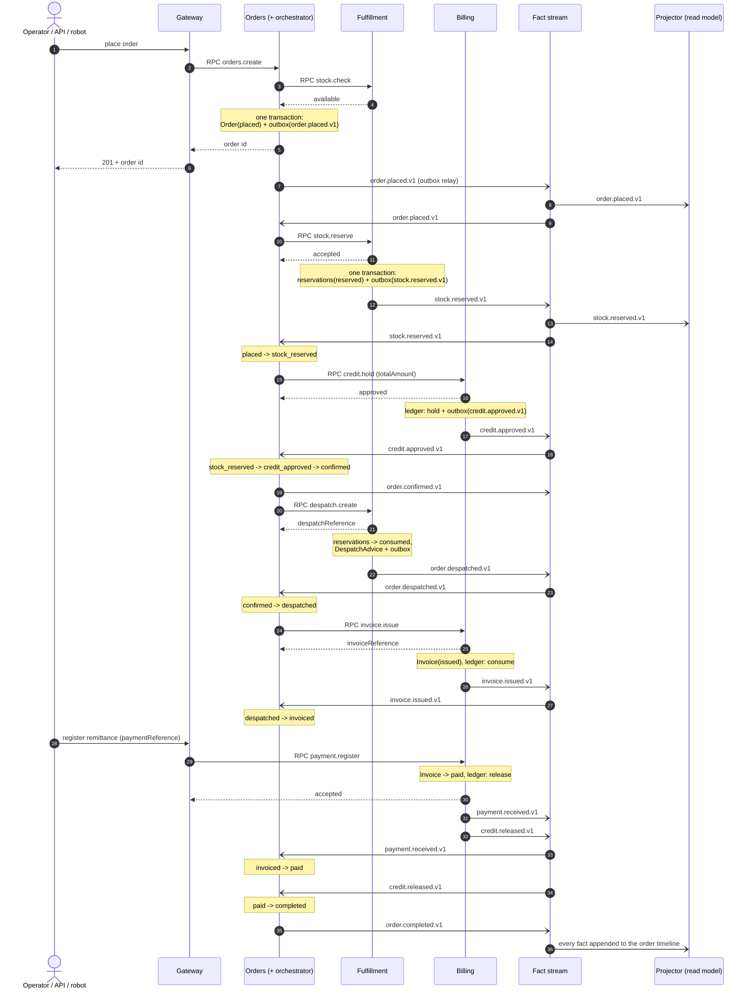
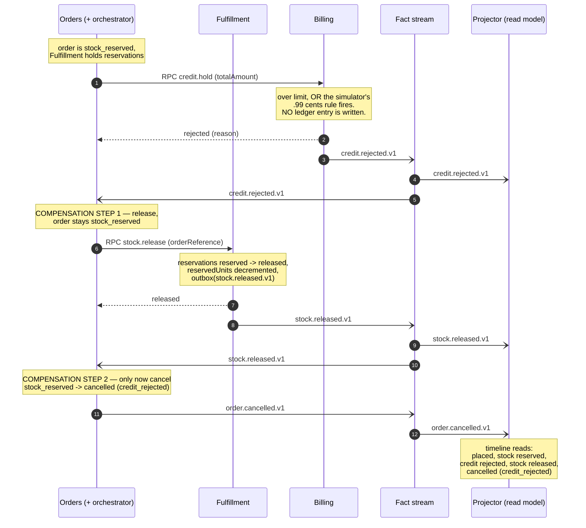

# The Order-To-Cash Saga — Shared Specification

> **Scope.** Stack-agnostic definition of the orchestrated order-to-cash saga,
> reused **verbatim** by assessments **#7**, **#8** and **#9**. It defines the
> sequence, the compensations and the idempotency contract. Transport client
> libraries, framework wiring and serialisation belong in each assessment's
> per-feature `design.md`.
>
> Companion documents: [`domain-model.md`](./domain-model.md) (aggregates, state
> machines, the thirteen facts) and [`requirements.md`](./requirements.md)
> (R19–R29 cover this document).

---

## 1. Shape of the saga

| Property | Decision |
|---|---|
| **Style** | **Orchestration.** A single explicit orchestrator lives in the **Orders** context. Choreography is documented as the alternative, not implemented. |
| **What advances it** | **Facts on the fact stream.** The orchestrator is a consumer; it never polls and never waits synchronously for a step to finish. |
| **What it issues** | **Commands over the RPC transport.** One responder, caller needs the answer now, a timeout is a legitimate and handled answer. |
| **Where the saga state lives** | **In the `Order` aggregate's `status` field.** There is no separate saga instance record. The saga state *is* the order state machine of `domain-model.md` §3.3, which is why every saga transition is already guarded by invariant **O5**. |
| **Correlation** | The **order id** is the `correlationId` of every fact, the partition key of the fact stream, and therefore the per-order ordering guarantee. |
| **Idempotency** | Every consumer records `(eventId, consumerName)` before/with its effects; every RPC command is idempotent by `(orderReference, operation)`. See §6. |

**Why both transports in one flow.** The saga is deliberately the place where the
two messaging styles meet, so the trade-off is demonstrated rather than asserted:

| | Fact stream (Kafka) | RPC transport (NATS request-reply) |
|---|---|---|
| Used for | Saga progression, projections, notifications, the audit timeline | Every saga command, the availability check, gateway queries |
| Semantics | "This happened" — immutable, many consumers, durable, replayable | "Do this / answer this" — one responder, answer needed now |
| If the peer is down | Facts wait in the log; the consumer catches up | The caller gets a timeout and handles it (retry, then DLQ) |
| Anti-pattern avoided | Using it as a request bus (correlation hell, latency) | Using it for facts (lost when the caller is down, no replay) |

---

## 2. The command vocabulary (RPC, not facts)

These are **requests**, not domain events. They never appear on the fact stream.

| Command | Caller | Responder | Idempotency key | Response |
|---|---|---|---|---|
| `stock.check` | Orders (acceptance, **not** the saga) | Fulfillment | — (read-only) | per-line available / insufficient |
| `stock.reserve` | Orchestrator | Fulfillment | `(orderReference, reserve)` | accepted / rejected + shortages |
| `stock.release` | Orchestrator | Fulfillment | `(orderReference, release)` | released / already-released |
| `despatch.create` | Orchestrator | Fulfillment | `(orderReference, despatch)` | `despatchReference` |
| `credit.hold` | Orchestrator | Billing | `(orderReference, hold)` | approved / rejected + reason |
| `invoice.issue` | Orchestrator | Billing | `(orderReference, issue)` | `invoiceReference` |
| `payment.register` | Gateway (operator, tests, external robot) | Billing | `paymentReference` | accepted / duplicate / rejected |

> **A command's response never advances the saga.** The orchestrator uses the
> response only to decide whether to retry the command. The saga advances only
> when the corresponding **fact** arrives, because only the fact is durable,
> replayable and observed by the projector and by notifications. This is the
> single most important rule in this document.

---

## 3. Happy path

### 3.1 Step table

| # | Trigger observed | Precondition (order status) | Orchestrator action | Command issued (RPC) | Fact emitted (fact stream) | Order status after |
|---|---|---|---|---|---|---|
| 0 | Operator/API places an order | *(no order yet)* | Orders checks availability synchronously, then persists the `Order` **and** its `order.placed.v1` record **in one transaction via the outbox**, and replies with the order id | `stock.check` (Orders → Fulfillment, before persisting) | `order.placed.v1` (Orders) | `placed` |
| 1 | `order.placed.v1` | `placed` | Reserve the stock for every line | `stock.reserve` (→ Fulfillment) | `stock.reserved.v1` (Fulfillment) | `placed` *(unchanged — the fact, not the command response, moves it)* |
| 2 | `stock.reserved.v1` | `placed` | Move the order to `stock_reserved`, then ask for a credit hold for `totalAmount` | `credit.hold` (→ Billing) | `credit.approved.v1` (Billing) | `stock_reserved` |
| 3 | `credit.approved.v1` | `stock_reserved` | Move to `credit_approved`, then **confirm** the order — the ORDRSP moment — and ask for the despatch advice | `despatch.create` (→ Fulfillment) | `order.confirmed.v1` (Orders), then `order.despatched.v1` (Fulfillment) | `credit_approved` → `confirmed` |
| 4 | `order.despatched.v1` | `confirmed` | Move to `despatched`, then ask for the invoice | `invoice.issue` (→ Billing) | `invoice.issued.v1` (Billing) | `despatched` |
| 5 | `invoice.issued.v1` | `despatched` | Move to `invoiced`. **The saga now waits for the outside world** — no internal timer, no polling | — | — | `invoiced` |
| 6 | `payment.received.v1` | `invoiced` | Move to `paid`. (Billing produced this fact when a remittance arrived through the gateway: operator button, API test, or the external payment robot. Billing marks the invoice `paid` and, in the same transaction, releases the credit exposure) | — | `payment.received.v1` then `credit.released.v1` (both Billing, same transaction, same partition) | `paid` |
| 7 | `credit.released.v1` | `paid` | **Close the saga**: move to `completed` and emit the closing fact | — | `order.completed.v1` (Orders) | `completed` |

**Steps 2 and 3 are two transitions in one handler.** On `credit.approved.v1` the
order moves `stock_reserved → credit_approved → confirmed` inside a single
aggregate load/save, emitting `order.confirmed.v1` once. Both transitions are
legal edges of Table T-1 and both are recorded in the timeline; the intermediate
`credit_approved` state is a real, observable state, not a fiction.

### 3.2 Sequence diagram — happy path

---

## 4. Compensation

The saga has exactly **two** failure paths, and they compensate **differently**.
The difference is the point of the demo: compensation is not a single generic
"undo", it is a path-specific unwinding of exactly the resources that were
actually acquired.

### 4.1 Path A — `stock.rejected.v1` (nothing to compensate)

| Trigger observed | Precondition | Orchestrator action | Command issued | Fact emitted | Order status after |
|---|---|---|---|---|---|
| `stock.rejected.v1` | `placed` | Cancel the order with reason `stock_rejected` | **none** | `order.cancelled.v1` | `cancelled` |

**Why no compensating command.** Reservation is **all-or-nothing** (invariant
**F3**): when `stock.rejected.v1` is emitted, *nothing was reserved*, so there is
nothing to release. Issuing `stock.release` here would be wrong twice over — it
would release reservations belonging to a *different* order attempt, and it would
put a phantom "stock released" step in the timeline of an order that never held
stock.

> **The race is real and intentional.** `stock.check` at acceptance is a
> non-locking read; `stock.reserve` later is the authoritative attempt. Another
> order may consume the units in between. That is precisely why the saga exists.

**R26 and R27 are the normative pair:** on `stock.rejected.v1` the orchestrator
**shall** cancel and **shall not** issue any release command.

### 4.2 Path B — `credit.rejected.v1` (release, *then* cancel)

| # | Trigger observed | Precondition | Orchestrator action | Command issued | Fact emitted | Order status after |
|---|---|---|---|---|---|---|
| B1 | `credit.rejected.v1` | `stock_reserved` | Begin compensation: release the stock this order is holding. **Do not cancel yet.** | `stock.release` (→ Fulfillment) | — | `stock_reserved` *(unchanged)* |
| B2 | `stock.released.v1` | `stock_reserved` | Compensation complete → cancel the order with reason `credit_rejected` | — | `order.cancelled.v1` | `cancelled` |

### 4.3 Compensation ordering — normative

The ordering is **release first, cancel second**, and it is not an implementation
detail:

1. **The order is the ledger of what must be unwound.** While the order is
   `stock_reserved`, the system can still see that a reservation is outstanding.
   Cancelling first would move the order to a terminal state while a reservation
   is still held — and `cancelled` is terminal (invariant **O7**), so a failed or
   lost release afterwards would leave stock stranded with no state left to
   drive a retry from.
2. **The transition that cancels is triggered by the compensating fact, not by
   the RPC response.** `stock.release` returning "released" is not proof the
   world changed durably; `stock.released.v1` arriving on the fact stream is. If
   the release command times out, the orchestrator retries it (R29) with the
   order still in `stock_reserved` — a safe, resumable state.
3. **Both steps must be visible.** The timeline must show `credit.rejected.v1`,
   then `stock.released.v1`, then `order.cancelled.v1`, in that causal order.
   A reviewer watching the demo has to *see* the stock go back. Cancelling first
   would put the terminal fact in the middle of the compensation.
4. **Nothing else needs releasing.** `credit.rejected.v1` means **no** ledger
   entry was written (invariant **B1** — a hold that would break the limit is
   rejected, not recorded and reversed), so there is no credit to release. Stock
   is the only acquired resource at that point in the flow.

**Generalisation.** Compensation unwinds acquisitions in **reverse order of
acquisition**, and only those that actually succeeded:

| Failure point | Acquired so far | Released, in this order | Then |
|---|---|---|---|
| `stock.reserve` fails | *(nothing)* | *(nothing)* | cancel `stock_rejected` |
| `credit.hold` fails | stock reservation | stock reservation | cancel `credit_rejected` |
| Operator cancels while `placed` | *(nothing)* | *(nothing)* | cancel `operator_cancelled` |
| Operator cancels while `stock_reserved` | stock reservation | stock reservation | cancel `operator_cancelled` |
| Operator cancels while `credit_approved` or `confirmed` | stock reservation, credit hold | credit hold (`credit.released.v1`, reason `order_cancelled`), then stock reservation (`stock.released.v1`) | cancel `operator_cancelled` |

Cancellation is impossible from `despatched` onwards (Table T-1): goods have
left, and unwinding is a commercial matter (credit note) that is out of scope.

### 4.4 Sequence diagram — `CreditRejected` compensation

---

## 5. Fact consumption map

| Fact | Orchestrator | Projector | Notifications |
|---|:---:|:---:|:---:|
| `order.placed.v1` | ✅ issue `stock.reserve` | ✅ | ✅ |
| `stock.reserved.v1` | ✅ → `stock_reserved`, issue `credit.hold` | ✅ | — |
| `stock.rejected.v1` | ✅ → `cancelled` (`stock_rejected`) | ✅ | — |
| `stock.released.v1` | ✅ → `cancelled` (`credit_rejected` / `operator_cancelled`) | ✅ | — |
| `credit.approved.v1` | ✅ → `credit_approved` → `confirmed`, issue `despatch.create` | ✅ | — |
| `credit.rejected.v1` | ✅ issue `stock.release` | ✅ | — |
| `credit.released.v1` | ✅ → `completed` when the order is `paid` | ✅ | — |
| `order.confirmed.v1` | — *(it emitted it)* | ✅ | ✅ |
| `order.despatched.v1` | ✅ → `despatched`, issue `invoice.issue` | ✅ | ✅ |
| `invoice.issued.v1` | ✅ → `invoiced` | ✅ | ✅ |
| `payment.received.v1` | ✅ → `paid` | ✅ | ✅ |
| `order.completed.v1` | — *(it emitted it)* | ✅ | ✅ |
| `order.cancelled.v1` | — *(it emitted it)* | ✅ | ✅ |

- **Projector consumes all thirteen.** It is the audit timeline; a fact it does
  not consume is a fact operations cannot see.
- **Notifications consumes seven**: `order.placed`, `order.confirmed`,
  `order.despatched`, `invoice.issued`, `payment.received`, `order.completed`,
  `order.cancelled`. The `stock.*` and `credit.*` facts are internal saga
  mechanics; their outcome reaches the counterparty as `order.cancelled.v1`
  carrying its `cancellationReason`.
- The orchestrator ignores the three facts it produced itself — consuming them
  would be a loop, and their effect is already in the aggregate.

---

## 6. Idempotency — why the orchestrator is safe

The fact stream is **at-least-once**. Every fact will eventually be redelivered:
after a consumer restart, after a rebalance, after an offset commit that lost a
race, after the outbox relay republishes a record whose acknowledgement was lost.
The saga is safe because of **three independent layers**, any one of which would
be insufficient alone.

### Layer 1 — the dedup record (first line of defence)

Every consumer records `(eventId, consumerName)` in the **same transaction** as
its effects (R17). On redelivery the record already exists, so the consumer
acknowledges and returns having mutated nothing and emitted nothing (R18). The
key is the pair, not the `eventId` alone: the projector, the orchestrator and
notifications must each process the same fact exactly once, independently.

### Layer 2 — the state-machine precondition (second line of defence)

Even if a dedup record were lost, every orchestrator handler is written as
*"WHEN fact F arrives AND the order is in status S, do X"*. The transition it
performs is legal exactly once, because performing it changes the status away
from `S`. A replay finds the order in the wrong precondition and is ignored
(R25). This also makes the orchestrator tolerant of **replaying the whole topic
from offset zero** — a completed order absorbs the entire history harmlessly.

### Layer 3 — idempotent commands (third line of defence)

If a handler *does* re-issue a command — because it crashed after issuing and
before committing its dedup record — the responder is idempotent by
`(orderReference, operation)` (R29). A second `stock.reserve` for an order that
already holds reservations returns the existing reservation without
double-reserving (invariant **F3**/**F4**); a second `credit.hold` returns the
existing hold (**B4**); a second `despatch.create` returns the existing reference
(**F8**); a second `invoice.issue` returns the existing invoice (**B7**); a
repeated `payment.register` with the same `paymentReference` returns the original
outcome and emits no second fact (**B10**, R48).

### Per-fact redelivery behaviour

| Redelivered fact | Order's status at redelivery | What happens | Why it is safe |
|---|---|---|---|
| `order.placed.v1` | any status ≠ *n/a* | Dedup record hit → ack, no command. If missed: `stock.reserve` re-issued, responder returns the existing reservation | Layers 1 + 3 |
| `stock.reserved.v1` | `stock_reserved` or later | Precondition `placed` unmet → ignored, recorded as out-of-order | Layers 1 + 2 |
| `credit.approved.v1` | `credit_approved`, `confirmed` or later | Precondition `stock_reserved` unmet → ignored. No second `order.confirmed.v1`, no second despatch | Layers 1 + 2 |
| `order.despatched.v1` | `despatched` or later | Precondition `confirmed` unmet → ignored. No second `invoice.issue` (and if issued, **B7** returns the existing invoice) | Layers 1 + 2 + 3 |
| `invoice.issued.v1` | `invoiced` or later | Precondition `despatched` unmet → ignored | Layers 1 + 2 |
| `payment.received.v1` | `paid`, `completed` | Precondition `invoiced` unmet → ignored. The invoice itself is already `paid`, and **B8** makes `paid → paid` illegal | Layers 1 + 2 |
| `credit.released.v1` | `completed` | Precondition `paid` unmet → ignored. No second `order.completed.v1` | Layers 1 + 2 |
| `stock.rejected.v1` | `cancelled` | `cancelled` is terminal (**O7**) → transition illegal → ignored. **Critically: still no release command is issued** | Layers 1 + 2 |
| `credit.rejected.v1` | `stock_reserved` (compensation in flight) or `cancelled` | Dedup record hit → ack. If missed and the order is still `stock_reserved`, `stock.release` is re-issued and the responder no-ops (**F5**, R34) without a second `stock.released.v1` | Layers 1 + 3 |
| `stock.released.v1` | `cancelled` | Precondition `stock_reserved` unmet → ignored. No second `order.cancelled.v1` | Layers 1 + 2 |

### Ordering guarantees the saga relies on

- **Per-order ordering.** All facts of one order share `correlationId = orderId`
  as the partition key, so facts from **one producing context** about one order
  arrive in emission order. This is what lets step 6 rely on
  `payment.received.v1` preceding `credit.released.v1` — Billing writes both
  outbox records in the same transaction, in that order, on the same partition.
- **No cross-context ordering is assumed.** Facts from Orders, Fulfillment and
  Billing may interleave arbitrarily. Every handler therefore states its
  precondition explicitly and never assumes "the previous fact has already been
  handled".
- **The read model tolerates disorder.** The projector orders the timeline by
  `occurredAt`, not by arrival, and never regresses the document's status
  (R50, R52).

### What is *not* claimed

- **Not exactly-once end to end.** The system is at-least-once delivery with
  **effectively-once processing**, achieved by the three layers above. There is
  no distributed transaction anywhere.
- **No global ordering** across contexts.
- **No saga timeout.** A saga that stalls at `invoiced` waiting for a remittance
  stays there indefinitely by design — payment arrives from the outside world,
  never from an internal timer. Stalls in the *automated* portion surface as
  orchestrator retries and, ultimately, as DLQ entries plus a saga-duration
  metric (R29, R59).

---

## 7. Failure handling inside the saga

| Failure | Behaviour |
|---|---|
| RPC command **times out** or returns a transport error | The orchestrator retries with backoff, up to N attempts. The order's status is **not** changed while retrying, so the saga is resumable from a legal state (R29). |
| RPC command retries **exhausted** | The triggering **fact** is routed to the dead-letter topic with the failing consumer, attempt count and error recorded, and a saga-failure entry is written to the timeline. The order stays in its last legal status for human intervention (R16, R29). |
| Responder returns a **business rejection** (insufficient stock, credit refused) | This is **not** a failure — it is a domain outcome. The responder emits the corresponding rejection **fact**, and the saga takes a compensation path (§4). No retry. |
| Fact **processing** throws inside a consumer | Retry with backoff; after N attempts the fact goes to `<topic>.dlq` and is acknowledged so the partition is not blocked (R16). |
| The orchestrator **crashes mid-step** | On restart it resumes from the last committed offset. Redelivery is absorbed by §6. |
| The outbox relay **cannot reach the broker** | Records stay unpublished (`publishedAt` unset) and are retried; nothing is lost because the fact was committed with the aggregate (R13, R14). Outbox lag is a monitored metric (R59). |

---

## 8. Traceability

| Section | Requirements |
|---|---|
| §3 happy path | R19, R20, R21, R22, R23, R24 |
| §4.1 `StockRejected` compensation | R26 |
| §4.2–§4.3 `CreditRejected` compensation and its ordering | R27, R28 |
| §5 consumption map | R50, R54 (projector); notifications set fixed here |
| §6 idempotency | R17, R18, R25, R29, R34, R48 |
| §7 failure handling | R16, R29, R59 |
